Table of Contenct
==================
### Notes :
__In this document for every project I have shown the flowchart and Result with a brief description. 
For Detail Presentation and Code please go to the Notebook link Provided for every project!!__
- (*) Means only organized code with comments
- (**) Means Code with basic doccumentation.
- (***) Means Code with Good Doccumentation.

### Kaggle Competetions and Job Entrance Problem :
 - [House Price Prediction :: Data Pre-Processing, ANN with tensorflow low level API and and Hiper-Parameter Tuning.  (***)](#house-price-prediction--data-pre-processing-and-hiper-parameter-tuning)
 - [Japanese Job Entrance Problem :: Shakura Bloom Prediction (***)](#japanese-job-entrance-problem--shakura-bloom-prediction)

### Machine Learning Algorithms from Scratch :

 - [Neural Network         :: Implementation from scratch with raw python (*)](#neural-network--nn-implementation-from-scratch)
 - [Decision Tree(ID3)     :: Implementation from scratch with continuous feature support. (***)](#decision-tree--id3-implementation-from-scratch)
 - [Naive Bayes            :: Implementation for text classification with text preprocesing from scratch (**)](#naive-bayes--implementation-for-text-classification)

Neural Network :: NN Implementation from scratch
================================================
### Notebook : [NN Implementation from scratch - Notebook (Project Presentation and Code Link) ](https://github.com/irfanhasib0/Machine-Learning/blob/master/Machine_Learning_Algo_From_Scratch/ANN_From_Scratch_modular_class.ipynb)

* Forward Propagation
* Backward Propagation

	a. Forward Propagation b. Back Propagation (Open Image in new tab for full resolution)

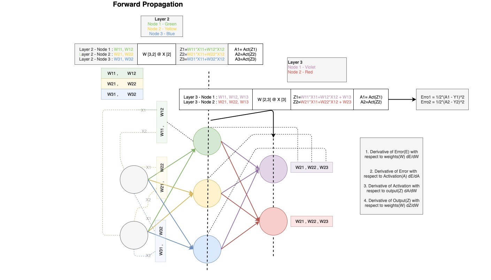
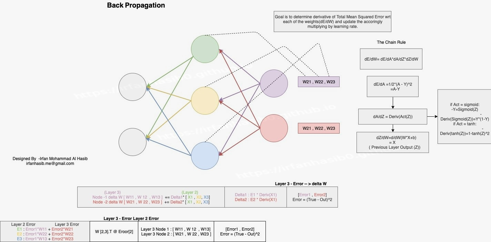

c. Result of ANN implementation for XOR data - mean sqaure error vs epoch -

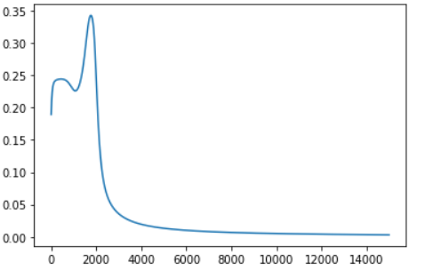
.

Decision Tree :: ID3 Implementation from scratch
====================================================
### Notebook : [ID3 Implementation from scratch - Notebook (Project Presentation and Code Link) ](https://github.com/irfanhasib0/Machine-Learning/blob/master/Machine_Learning_Algo_From_Scratch/ID3_with_continuous_feature_support_exp.py)

* __Dataset     :__ Titanic and irish dataset was used for testing ID3.
* __Steps       :__
                  -Continuous data spliting based on information gain.
                  -Information Gain Calculation Function.
                  -ID3 Algorithm according to flowchart.

* __Tuning     :__ Reduced Error Pruining.
* __Prediction :__ Accuracy,Precision,Recall Reporting.
 
 ### ID3 Flow Chart of Implementation (Open Image in new tab for full resolution)

 #### Result of ID3 implementation for iris data - a.Precision Recall and Accuracy and b.True Label vs Prediction -

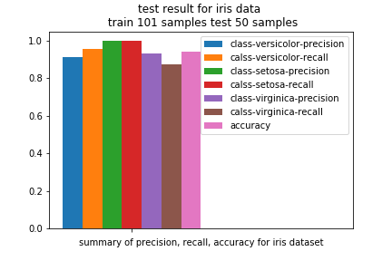

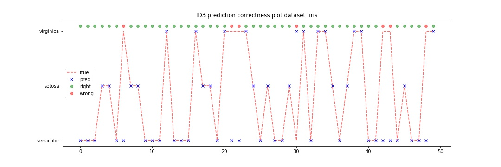

 #### Result of ID3 implementation for Titanic data - a.Precision Recall and Accuracy and b.True Label vs Prediction

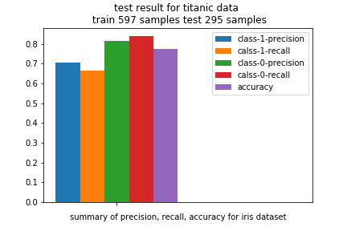

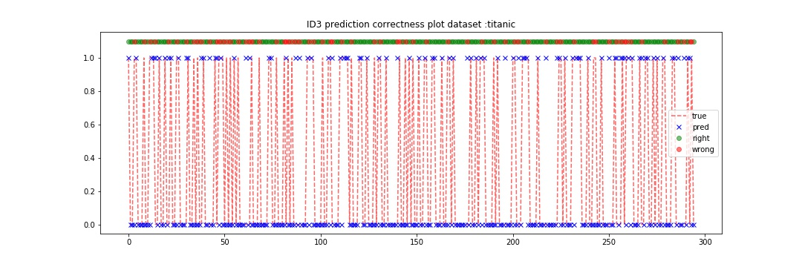

.

Naive Bayes :: Implementation for text classification
==========================================================

### Notebook : [Naive Bayes Implementation from scratch - Notebook (Project Presentation and Code Link) ](https://github.com/irfanhasib0/Machine-Learning/blob/master/Machine_Learning_Algo_From_Scratch/Naive_Bayes_Stack_Exchange.ipynb)

* Archived data from stack exchange is used for classification.
* Text Preprocessing was done with raw python without nltk.
	Naive Bayes algorithm applied on the procesed text.
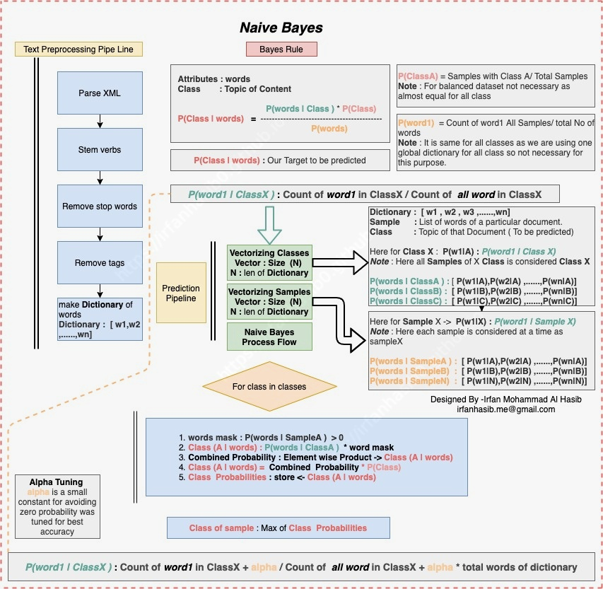

* Result of Naive Bayes implementation for Stack Exchange data - a.Precision Recall and Accuracy and b.True Label vs Prediction

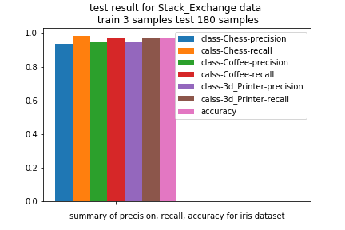

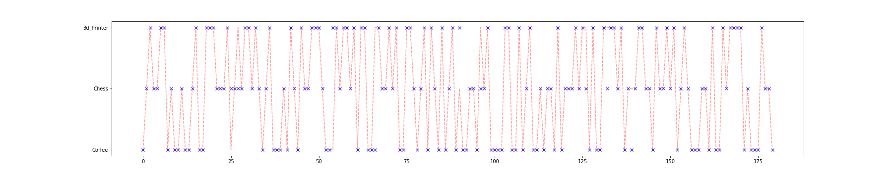

House Price Prediction :: Data Pre-Processing and Hiper-Parameter Tuning
==================================================================================================
### Notebook : [House Price Prediction - Notebook (Project Presentation and Code Link) ](https://github.com/irfanhasib0/Machine-Learning/blob/master/Kaggle/ANN_Tensorflow__Kaggle_Houseprice_prediction.ipynb)
   
 *  __Dataset :__ House Price Dataset of kaggle.com
 *  __Steps :__  
                 - Data Preprocessing
                 - Implementing Nural Network with tensorflow low level API.
                 - Hiper-Parameter Tuning for ANN
### 1.0 Project Flow Chart :
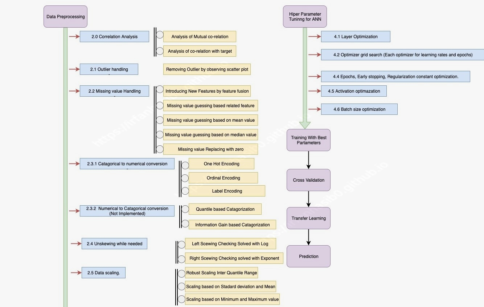

### Cross validation(MSLE) and Kaggle Result(RMSLE)
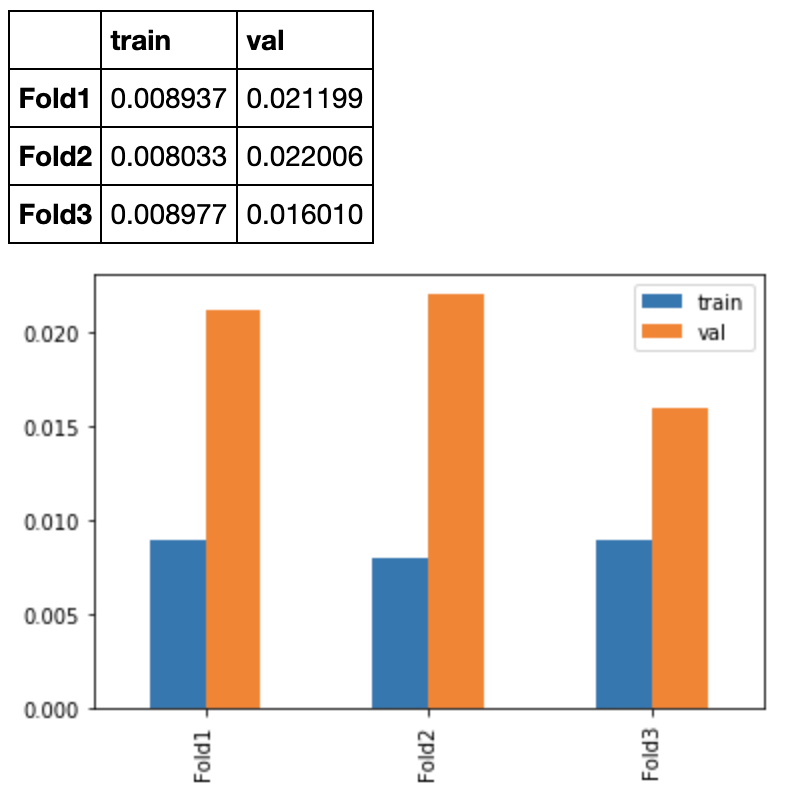
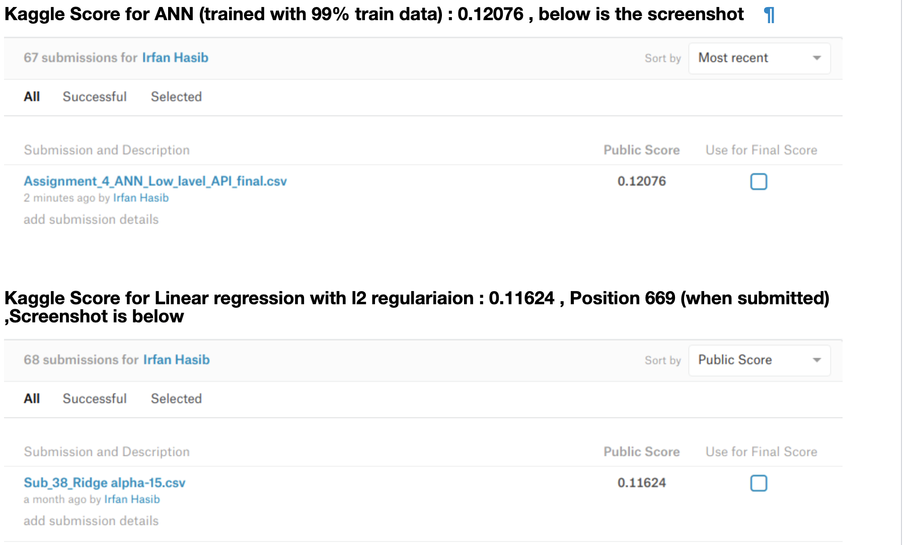 
     

 

Japanese Job Entrance Problem :: Shakura Bloom Prediction
==================================================================================================

### Notebook : [Shakura Bloom Prediction - Notebook (Project Presentation and Code Link)](https://github.com/irfanhasib0/Machine-Learning/blob/master/Kaggle/Sakura_TF_NN_Report.ipynb)
   
 *  __Dataset :__ Weather data from japanese meteorological agency
 *  __Steps :__  
                 - Data Preprocessing
                 - Implementing Nural Network with tensorflow low level API.
                 - Hiper-Parameter Tuning for ANN

 
### 1.0 Project Flow Chart :
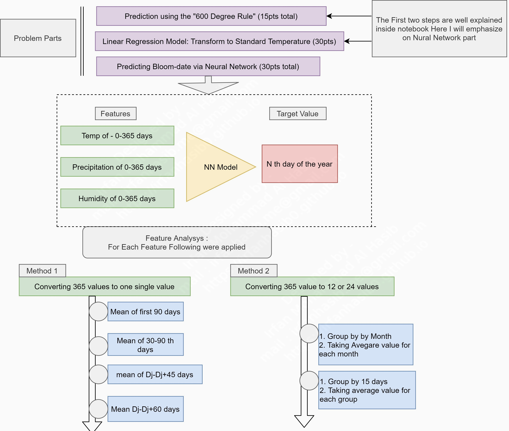
     
### Cross Validation R2 Score :
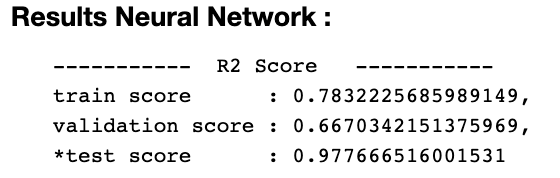 

