Table of Content
===============================


##### Note :
__In this document for each projects is shown as :__
   
   - Link of Jupyter Notebook with implementation code and detail description.
   - Overview
   - Flowchart of the project.
   - Result vedio / gif / graphs.
   - The no of star after every project means the level of documentation.
   
__For detail description and Code please go to the Notebook link Provided for every project!!__

<div><p  style="color:grey;" >
    <a id="table_of_content_link"></a>  </p>
</div>

### Kaggle Competetions and Job Entrance Problem :
<ul>
  <li><a style="color:navyblue;font-size:15px;" 
href ='#house_price_link'> Kaggle House Price Prediction :: Data Pre-Processing, ANN with tensorflow low level API and and Hiper-Parameter Tuning.  (****)</a></li>
  <li><a style="color:navyblue;font-size:15px;" 
         href ='#sakura_link'> Japanese Job Entrance Problem :: Shakura Bloom Prediction (****)</a></li>
</ul>

### Machine Learning Algorithms from Scratch :
<ul>
  <li><a style="color:navyblue;font-size:15px;" 
href ='#ann_link'> Neural Network         :: Implementation from scratch with raw python (**)  (****)</a></li>
  <li><a style="color:navyblue;font-size:15px;" 
         href ='#id3_link'> Decision Tree(ID3)     :: Implementation from scratch with continuous feature support. (****)</a></li>
  <li><a style="color:navyblue;font-size:15px;" 
         href ='#naive_bayes_link'> Naive Bayes            :: Implementation for text classification with text preprocesing from scratch (**)</a></li>
</ul>
 

### Reinforcement Learning ALgorithms from scratch :
<ul>
  <li><a style="color:navyblue;font-size:15px;" 
href ='#dqn_ddpg_link'> DQN(Deep Q Learning) from scratch with Tensorflow-KERAS(**)</a></li>
  <li><a style="color:navyblue;font-size:15px;" 
href ='#dqn_ddpg_link'> DDPG(Deep Deterministic Policy Gradient) from scratch with Tensorflow(**)</a></li>
</ul>
 
 
### Control Algorithms Implementation from scratch :

<ul>
  <li><a style="color:navyblue;font-size:15px;" 
href ='#ilqr_mpc_link'> ILQR(Iterative Linear Quadratic Regulator) Implementation from scratch(****)</a></li>
  <li><a style="color:navyblue;font-size:15px;" 
href ='#ilqr_mpc_link'> MPC(Model Predictive Controller) Implementation from scratch(**)</a></li>
</ul>
 


### CNN Projects : (Minimal Doccumentation)
<ul>
  <li><a style="color:navyblue;font-size:15px;" 
href ='#yolo_link'> Yolo with KERAS and Tensorflow for car number plate localization</a></li>
  <li><a style="color:navyblue;font-size:15px;" 
href ='#unet_link'> Unet with KERAS for City Space Dataset</a></li>
</ul>


### ROS Project : (Not well doccumented)
<ul>
  <li><a style="color:navyblue;font-size:15px;" 
href ='#ros_rrbot_link'> ROS : Simple two linked robot inspired from rrbot(-)</a></li>
  <li><a style="color:navyblue;font-size:15px;" 
href ='#ros_husky_link'> ROS : Writing a script for driving husky robot and getting feed back</a></li>
</ul>


### International Robotics Compititions 
<ul>
  <li><a style="color:navyblue;font-size:15px;" 
href ='#urc_2016_link'> University Rover Challenge - 2016</a></li>
</ul>


### Embedded System Projects for Pi Labs BD Ltd :
 - Vault Sequirity : IOT based Vault sequitrity System with AVR Microcontroller
 - Safe Box : GPRS based Tracking System with AVR Microcontroller
 - Syringe Pump : RTOS Progmable Infusion Pump with AVR Microcontroller
 - Digital Weight Machine : Server based digital wight Machine with AVR Microcontroller
 - <a style="color:navyblue;font-size:15px;" 
href ='#pi_project_link'> Presentation Link : Embedded System Projects for Pi Labs BD Lt</a></li>

### Academic Project and Thesis (Undergrad) :
 - Remote rescue robot with AVR Microcontroller
 - Car velocity mseasuring and logging system for genearting drive cycle of Dhaka
 - <a style="color:navyblue;font-size:15px;" 
href ='#buet_project_link'>Presentation Link : Academic Project and Thesis</a></li>

<style>
h1 {color:grey;}
h3 {color:#48C9B0;}
a  {color:navyblue;}

#ul_style {
    color:gray ;
    list-style-type:circle;
    } 
    
#div_style {
background-color:#F8F9F9;
}

#ul_st {
    color : #641E16;
    }

</style>


<div>
<br><h1  style="color:grey;" >
<a id="house_price_link"></a> 
    House Price Prediction :: Data Pre-Processing and Hiper-Parameter Tuning</h1></br>
<a style="color:navyblue;font-size:25px;" href= https://github.com/irfanhasib0/Machine-Learning/blob/master/Kaggle/ANN_Tensorflow__Kaggle_Houseprice_prediction.ipynb>  Notebook : House Price Prediction - Notebook (Project Presentation and Code Link) </a>

</div>

<h3> 1. Overview :</h3>
     
<div id=div_style>
    <ul id=ul_style>
        <b><I>
        <li>House Price Dataset from kaggle.com</li>
        <li>Data Preprocessing</li>
        <li>ANN Class with tensorflow low level API </li>
        <li>Hiperparameter Tuning</li>
        <li>All the graphs of Data preprocessing and Hiperparameter Tuning can be found in <a href = https://github.com/irfanhasib0/Machine-Learning/blob/master/Kaggle/ANN_Tensorflow__Kaggle_Houseprice_prediction.ipynb> Notebook </a></li>
        </I></b>
    </ul>
<details false>
    <summary><b><I><font color="#3498DB"> Click to expand</font></I></b></summary>
    
<ul style="list-style-type:none;" >
<li><b> Dataset : </b> House Price Dataset of kaggle.com </li>
<li><b> Data Preprocessing : </b></li>
            <ul>
            <li> 2.0 Correlation Analysis </li>
            <li> 2.1 Outlier handling </li>
            <li> 2.2 Missing value Handling </li>
            <li> 2.3 Catagorical to numerical conversion </li>
            <li> 2.4 Unskewing while needed </li>
            <li> 2.5 Data scaling </li>
            </ul>
<li><b> ANN Class with tensorflow low level API : </b></li>
            <ul>
            <li> Method train </li>
            <li> Method predict </li>
            <li> Method save weights </li>
            <li> Method load weights </li>
            </ul>
<li> Each preprocessing step's effectiveness is checked by simple linear regression </li>
<li><b> Hiperparameter Tuning : </b></li>
            <ul>
            <li> 4.1 Layer Optimization </li>
            <li> 4.2 Optimizer grid search (Each optimizer for learning rates and epochs) </li>
            <li> 4.3 Learning Rate Optimization </li>
            <li> 4.4 Epochs, Early stopping, Regularization constan optimization </li>
            <li> 4.5 Activation optimazation </li>
            <li> 4.6 Batch size optimization </li>
            </ul>
</ul>
<ul>
<li> Cross-Validation with 3 fold was done for overfitting testing </li>
<li> Test result was submitted in kaggle.com for evaluation screenshot can be found at result section </li>
<li> All the graphs of Data preprocessing and Hiperparameter Tuning can be found in <a href = https://github.com/irfanhasib0/Machine-Learning/blob/master/Kaggle/ANN_Tensorflow__Kaggle_Houseprice_prediction.ipynb> Notebook </a>  </li>
</ul>    
</details>
</div>

<h3> 2. Project Flow Chart :</h3>


<h3> 3. Cross validation(MSLE) and Kaggle Result(RMSLE) </h3>

</br>
     
<a style="color:navyblue;font-size:15px;" 
href ='#table_of_content_link'>Go Back to Table of Content</a>
 
<div>
<br><h1  style="color:navyblue;" >
<a id="sakura_link"></a> 
    Japanese Job Entrance Problem :: Shakura Bloom Prediction</h1></br>
<a style="color:navyblue;font-size:25px;" href= https://github.com/irfanhasib0/Machine-Learning/blob/master/Kaggle/Sakura_TF_NN_Report.ipynb>   Notebook : Shakura Bloom Prediction - Notebook (Project Presentation and Code Link) </a>

</div>


<h3> 1. Overview </h3>
<div id=div_style>
<ul id=ul_style>
        <b><I>
        <li>Weather data from japanese meteorological agencym</li>
        <li>Feature Extraction and Data Preprocessing</li>
        <li>ANN Class with tensorflow low level API </li>
        <li>Hiperparameter Tuning</li>
        <li>All the graphs of Data preprocessing and Hiperparameter Tuning can be found in <a href = https://github.com/irfanhasib0/Machine-Learning/blob/master/Kaggle/Sakura_TF_NN_Report.ipynb> Notebook </a></li>
        </I></b>
    </ul>
<details false>
        <summary><b><I><font color="#3498DB"> Click to expand</font></I></b></summary>
<ul style="list-style-type:none;">    
<li><b> Dataset : </b></li> Weather data from japanese meteorological agency
<li><b> Steps :</b></li>
                 <ul>
                 <li> Feature Analysis and Data Preprocessing </li>
                 <li> Implementing Nural Network with tensorflow low level API. </li>
                 <li> Hiper-Parameter Tuning for ANN </li>
                 </ul>
<li><b> Data Preprocessing : </b></li>
         <ul>
         <li><b> Converting features of a whole year(365/366 samples) to a single vector for adding feature vector.  </b></li>
                    <ul>
                     <li>  Converting all the 365 days daya to a single feature</li>
                        <ul>
                        <li> 1. Days after bloom can be ignored. As weather before bloom can effect blooom date </li>
                        <li> 2. Days days before Dj- 'Last day of hibernation' is less significant </li>
                        <li> 3. Feature with high correlation i.e max temp, hr1 preci can be specially considered for processing </li>
                        </ul>
                        <li>  Converting all the 365 days daya to a single feature </li>
                         <ul>
                         <li> 1. Mean of first 90 days </li>
                         <li> 2. Mean of 30-90 th days </li>
                         <li> 3. mean of Dj-Dj+45 days </li>
                         <li> 4. Mean Dj-Dj+60 days </li>
                         <li> 5. Mean of Dj-Dj+75 </li>
                         </ul>
                     </ul>
        <li><b> Feature Selection </b></li>
               <ul>
               <li> Co-relation analysis </li>
               <li> Accuracy of the linear regression after adding each feature </li>
               </ul>
       <li><b> Highly Corelated feaure specially anayzing and processing.  </b></li>
       <li><b> Outlier analysis.  </b></li>
       <li><b> Scaling the data considering interquantile range  </b></li>
       </ul>
<li><b> Hiperparameter Tuning : </b></li>
             <ul>
             <li> 1. Layer Optimization </li>
             <li> 2. Optimizer grid search (Each optimizer for learning rates and epochs) </li>
             <li> 3. Learning Rate Optimization </li>
             <li> 4. Epochs, Early stopping, Regularization constant optimization. </li>
             </ul>
</ul>    
</details>
</div>

<h3> 2. Project Flow Chart :</h3>

     
<h3> 3. Cross Validation R2 Score :</h3>
</br>

<a style="color:navyblue;font-size:15px;" 
href ='#table_of_content_link'>Go Back to Table of Content</a>

<div>
<br><h1  style="color:grey;" >
<a id="ann_link"></a> 
   Neural Network :: NN Implementation from scratch</h1></br>
<a style="color:navyblue;font-size:25px;" href= https://github.com/irfanhasib0/Machine-Learning/blob/master/Machine_Learning_Algo_From_Scratch/ANN_From_Scratch_modular_class.ipynb> Notebook : NN Implementation from scratch - Notebook (Project Presentation and Code Link) </a>
</div>

<h3> 1. Overview :  </h3>

<div id=div_style>
   <p>Here I  have implemented Neural Network of 3 Layers. I have implemented A Layes Class and functions 
   for Forward propagation,backward propagation and updating weights. I just tested it XOR data. It was fitting good.</p>
<ul id=ul_style>
        <b><I>
        <li>XOR Data used for testing</li>
        <li>Forward Propagation</li>
        <li>Backward Propagation</li>
        <ul>
        <li>Calculating Gradients </li>
        <li>Updating weights</li>
        </ul>
        </I></b>
</ul>
<details false>
<summary><b><I><font color="#3498DB"> Click to expand</font></I></b></summary>
<ul style="list-style-type:none;">  
   <li><b> Forward Propagation : </b></li>
          <ul>
          <li> Output of a neuron : Z = W*X + B , Mentioned as Neuron Output </li>
            <ul style="list-style-type:circle;">
            <li> W(a,b) a for current layer, b for previous layer </li>
            <li> Layer2:Z1 = Layer2:W11 * X_layer1_node1 + Layer2:W21 * X_layer_node_2 + Layer2:Bias </li>
            <li> Layer2:Z2 = Layer2:W11 * X_layer1_node1 + Layer2:W21 * X_layer_node_2 + Layer2:Bias </li>
            </ul>
          <li> Adding Non-Linearity : A = Activation(Z) [ Act(Z) in the flow chart] , Mentioned as Activation Output. </li>
          <li>(For detail better under understanding mutual weight indexing W(a,b) see appendix on Nodes)</li>
          </ul>
<li><b>  Calulating gradients : </b></li>
          <ul>          
          <li> Calculatin dE/dW (dE/dW : grad of error wrt each weights ) </li>
             <ul>
             <li> dE/dW = dE/dA * dA/DZ * dZ/dw 
             </ul>
          <li> Calculatin dE/dA  (dE/dA : grad of error wrt each Activation output ) </li>
                <ul>
                <li>dE/dA : For Last Layer, if loss function is mean square error, then E = 1/2*(Y - A)^2 so , dE/dA = (A-Y </li>
                <li> dE/dA : For Other Layers dE/dA will be inherited from the each of the node of next layer acccording
                to mutual weights. </li>
                <li> Layer2:Error1 = layer3:Error1 * Layer3:W11 + Layer3:Error2 * Layer3:W21 </li>
                <li> Mathmetically Implmented as Error_l2 = Weights_l3.Transpose() * Error_l3 </li>
                </ul>
          <li>Calculating dA/dZ (dA/dZ : grad of Activation Output wrt each Neuron output  also mentioned as delta here) </li>
                <ul>
                <li> It is just Derivative of sigmoid function in my case : delta = A*(1-A)
                </ul>
          <li> Calculating dZ/dW (dZ/dW : grad of Neuron Output wrt each weights ) </li>
                 <ul>
                 <li> As Z = W*X +B so dZ/dW = X , where for first layer, X is the input  </li>
                 <li> For other layers, the output from previous layer. </li> 
                 </ul>
          </ul>
<li><b>  Updating Weights: </b></li>
    <ul>
    <li> Updating each weights W = W + alpha*dW/dE </li>
    <li> Here alpha is the learning rate. </li>
    </ul>  
<li><b> Note : </b></li> In the flowchart Gradient calcultion is shown in back propagation.
</ul>
</details>
</div>

<h3> 2. Process Flow Chart : (Open Image in new tab for full resolution)</h3>

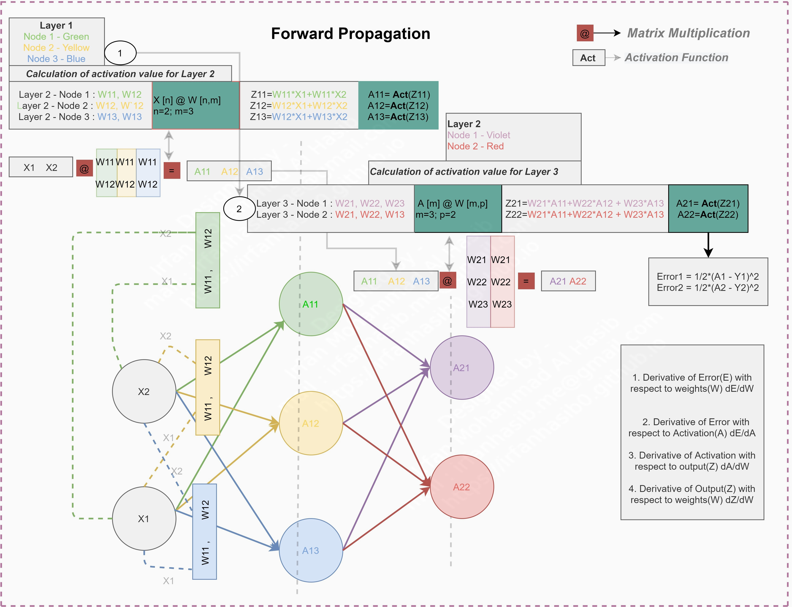
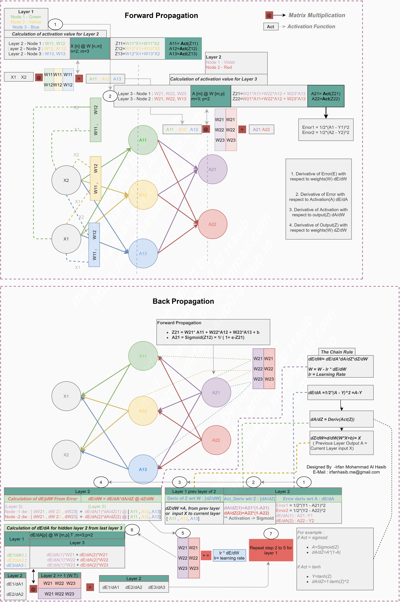


<h3> Result : </h3>
     Result of ANN implementation for XOR data - mean sqaure error vs epoch -


<h3> Appendix :</h3>

<h4> Nodes : </h4>
<div id=div_style>
<details>
    <summary><b><I> Click to toggle expand view </I></b></summary>
    <ul style="list-style-type:square;">  
    <li> Every Node/Neuron is considered to have weights for each of previous layers node.</li>
    </ul>
         <br>Leyer 1 ->2 nodes 
         <br>Layer 2 ->3 Nodes
         <br>So, Layer 2's each of the 3 Nodes will have two weights for Layer 1's each of the 2 nodes.
         <br>they are -
         <br>Layer 2 - Node 1: W11 , W12
         <br>Layer 2 - Node 2: W21 , W22
         <br>Layer 2 - Node 3: W31 , W32
         <br>Value of Layer 2:Node1 (Z21) = X1 * Layer2:W11 + X2 * Layer2:W12
         <br>Mutual Weights: Layer:W(a,b) : 
             <br>a is the node we are calculating for (current layer)
             <br>b is the contributing node (from previous layer)
             <br>i.e 
              <br>Layer2:W12 --> Layer 2's 1st node's weight for previous layers(Layer 1) 2nd node
              <br>Layer2:W13 --> Layer 2's 1st node's weight for previous layers(Layer 1) 3rd node
</details>
</div>

<a style="color:navyblue;font-size:15px;" 
href ='#table_of_content_link'>Go Back to Table of Content</a>
    
<div>
<br><h1  style="color:grey;" >
<a id="id3_link"></a> 
    
   Decision Tree :: ID3 Implementation from scratch</h1></br>
<a style="color:navyblue;font-size:25px;" href= https://github.com/irfanhasib0/Machine-Learning/blob/master/Machine_Learning_Algo_From_Scratch/ID3_with_continuous_feature_support-updated.ipynb>Notebook : ID3 Implementation from scratch - Notebook (Project Presentation and Code Link)</a>
</div>


<h3> 1. Overview </h3>
<div id=div_style>
<ul id=ul_style>
<li><b><I>Dataset     :</li></b></I> Titanic and irish dataset was used for testing ID3.
<li><b><I> Steps      :</li></b></I>
                  <ul>
                  <li>Continuous data spliting based on information gain </li>
                  <li>Information Gain Calculation  </li>
                  <li>ID3 Algorithm according to flowchart </li>
                  </ul>

<li><b><I> Tuning     :</li></b></I> Reduced Error Pruining.
<li><b><I> Prediction :</li></b></I> Accuracy,Precision,Recall Reporting.
</ul>
</div>


<h3> ID3 Flow Chart of Implementation (Open Image in new tab for full resolution) </h3>


<h3> Result of ID3 implementation for iris data - a.Precision Recall and Accuracy and b.True Label vs Prediction - </h3>


<h3> Result of ID3 implementation for Titanic data - a.Precision Recall and Accuracy and b.True Label vs Prediction </h3>


<a style="color:navyblue;font-size:15px;" 
href ='#table_of_content_link'>Go Back to Table of Content</a>

<div>
<br><h1  style="color:grey;" >
<a id="naive_bayes_link"></a> 
   Naive Bayes :: Implementation for text classification</h1></br>
<a style="color:navyblue;font-size:25px;" href= https://github.com/irfanhasib0/Machine-Learning/blob/master/Machine_Learning_Algo_From_Scratch/Naive_Bayes_Stack_Exchange.ipynb> Naive Bayes Implementation from scratch - Notebook (Project Presentation and Code Link) </a>
</div>


<h3> 1. Overview </h3>

<div id=div_style>
<ul id=ul_style>
<li><b><I> Dataset     :</li></b></I> Archived data from stack exchange is used for classification.
<li><b><I> Steps      :</li></b></I>
                  <ul>
                  <li>Text Preprocessing was done with raw python without nltk. </li>
                  <li>Calculating Attribute Probabilities for each class  </li>
                  <li>Applying Bayes Theorem for getting class probality </li>
                  </ul>
<li><b><I> Tuning     :</li></b></I> The model was Tuned for best alpha values.
<li><b><I> Prediction :</li></b></I> Accuracy,Precision,Recall Reporting.
</ul>
</div>


<h3> Naive Bayes algorithm applied on the procesed text.</h3>


* Result of Naive Bayes implementation for Stack Exchange data - a.Precision Recall and Accuracy and b.True Label vs Prediction


<a style="color:navyblue;font-size:15px;" 
href ='#table_of_content_link'>Go Back to Table of Content</a>

<div>
<br><h1  style="color:grey;" >
<a id="ilqr_mpc_link"></a> 
   ILQR and MPC :: Implementation from scratch for self driving car simulator</h1></br>

<br><a style="color:navyblue;font-size:25px;" href=https://github.com/irfanhasib0/Control-algorithms/blob/master/MPC_GYM_CAR_RACING_V0/ilqr_on_airsim_env_map_tracker_rel-exp.ipynb> Notebook : ILQR Implementation - Notebook (Project Presentation and Code Link) </a></br>
<a style="color:navyblue;font-size:25px;" href= https://github.com/irfanhasib0/Control-algorithms/blob/master/MPC_GYM_CAR_RACING_V0/mpc_on_car_env_map_tracker_rel.ipynb> Notebook : MPC Implementation - Notebook (Project Presentation and Code Link)</a>
</div>

<h3> 1. Overview : </h3>
<div id=div_style>
<ul id=ul_style>
        <li><b><I> Simulation Platform : </b></I></li>
            <ul style="list-style-type:circle;">
                <li> AIRSIM by Microsoft Inc. </li>
                <li> OpenAI GYM - Car Environment was tested</li>
            </ul>
        <li><b><I>IO :</b></I></li> Input --> Map Points , Output --> Steering Angle, Acclelation, Brake
        <li><b><I>MAP to Trajectory : Steps : </b></I></li>
            <ul style="list-style-type:circle;">
                <li>  Environment Module </li>
                <li>  Map Tracker Module </li>
                <li>  Data Preprcessor Module</li>
            </ul>
        <li><b><I> Optimaization Algorithm : Trajectory to Optimal Steering,Accleration,Brake : </b></I></li>
            <ul>
                <li>iLQR using Raw Python and Numpy</li> 
                <li>MPC using Python , Numpy and CVXPY</li>
            </ul>
    </ul>

        
<details false>
    <summary><b><I><font color="#3498DB"> Click to expand</font></I></b></summary>
<ul style="list-style-type:none;">
 
<li><b>  Simulation Environment : </b></li>
    <ul>
    <li> AIRSIM a Car Simulator by Microsoft </li>
    <li> OpenAI gym Car ENnvironment. </li>
    </ul>
<li><b> Original Paper of ILQR Part of the Project </b></li>
                    <ul style="list-style-type:none;"><li>
                    Synthesis and Stabilization of Complex Behaviors through Online Trajectory Optimization By - Y Tassa</li></ul>
<li><b>  I0 :   </b></li>
                    <ul style="list-style-type:none;"><li>
                        Input --> Map Points , Output --> Steering Angle, Acclelation, Brake</li></ul>
<li><b>  Steps :  </b></li>
                 <ul>
                 <li> Map Tracker Module </li>
                         <ul>
                         <li> Input : Takes Map points as Input
                         <li> Trajectory Queue : Gets N next points from map points to follow according to car position and orientation.
                         <li> Update Trajectory Queue : Update the queue of points to follow with moving car position and orientation.
                         <li> Output : Next N points to follow from Trajectory Queue
                         </ul>
                <li> Data Preprcessor Module : </li>
                         <ul>
                         <li> Input : Trajectory points from Map tracker module.
                         <li> Full State Calculation : Calculates yaw from ref points and target velocity.
                         <li> Relative Trajectory calculation : Relative Co-ordinates calculation as Car position nad yaw as                         origin.
                         <li> Output : Adjusts no of points to track in the refference trajectory accrding to current velocity.  
                         </ul>
                 <li> ILQR Module </li>
                          <ul>
                           <li> Input : Refferance trajectory to follow from Data Processor module. </li>
                          <li> Output : Calculate Optimal steering angle and accelaration with ILQR algorithm shown below. </li>
                          </ul>
                 OR,
                 <li> MPC Module</li>
                              <ul>
                              <li> Input : Refferance trajectory to follow from Data Processor module. </li>
                              <li> Output : Calculate Optimal steering angle and accelaration with MPC algorithm shown below. </li>
                              </ul>
                 </ul>
</ul>    
</details>
</div>

<h3>  2. Project Flow Chart : </h3>

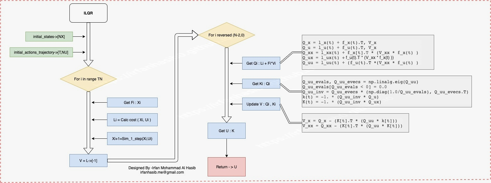


     
<h3> 3. Results (ILQR) : </h3>
* OpenAI Gym Car Environment 
* Airsim City Space Environment 
* Airsim Neighbourhood Environment 


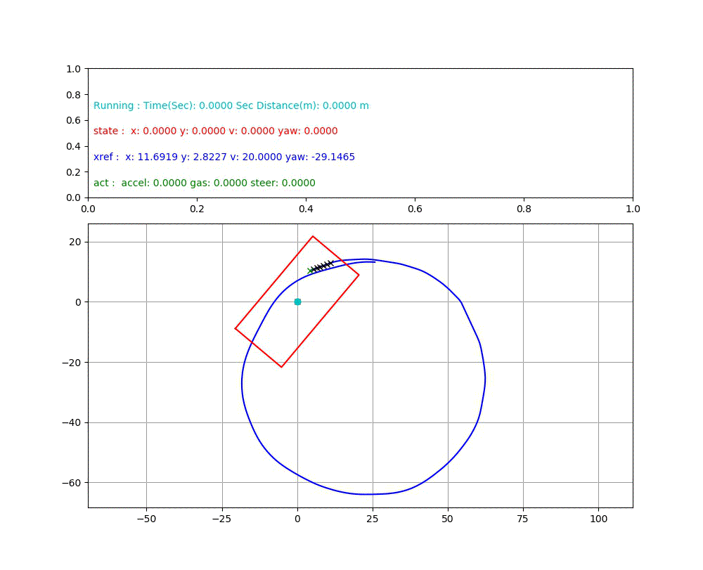


<h3> Appendix : Map Tracker </h3>
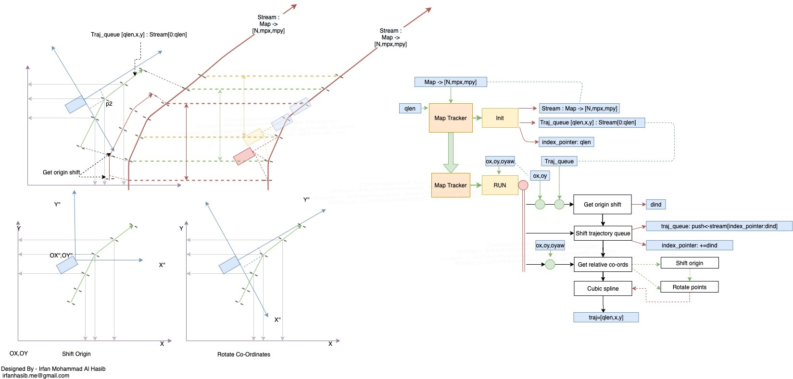
     
     

<a style="color:navyblue;font-size:15px;" 
href ='#table_of_content_link'>Go Back to Table of Content</a>

<div>
<br><h1  style="color:grey;" >
<a id="dqn_ddpg_link"></a> 
   DQN and DDPG:: Implementation from scratch</h1></br>
<br><a style="color:navyblue;font-size:25px;" href= https://github.com/irfanhasib0/RL-Algorithms/blob/master/Deep_Q_Learning_mc.ipynb> Notebook : Mountain Car with DQN - Notebook (Project Presentation and Code Link) </a></br>
<a style="color:navyblue;font-size:25px;" href= https://github.com/irfanhasib0/RL-Algorithms/blob/master/Deep_Q_Learning_mc.ipynb> Notebook : Pendulum with DDPG - Notebook (Project Presentation and Code Link) </a>
</div>


<h3> 1.  Overview </h3>

<div id=div_style> 
<ul id=ul_style>
    <li><b><I> DQN Environments </li></b></I>  OpenAI gym --> Mountain Car ENvironment
    <li><b><I> DQN Environments </li></b></I>  OpenAI gym --> Pendulumn Environment
    <li><b><I> DQN Steps </li></b></I>
    <ul>
    For each time step of a episode 
    <li> action : explore -> random | or exploit -> max Q value based on epsilon decay </li>
    <li> play one step -> store experience </li>
    <li> sample minibatch </li>
    <li> target Q values : reward+gamma*Q_network(new_state,new_actions) </li> 
    <li> train Q network </li>
    </ul>
    <li><b><I> DDPG Steps </li></b></I>
    <ul>
    For each time step of a episode 
    <li>actor(state): action + OU Noise </li>
    <li>play one step -> store experience </li>
    <li>sample minibatch </li>
    <li>target Q values : reward+gamma*target_critic(new_state,new_actions) </li>
    <li>actor loss from critic(state,action)</li>
    <li>train actor and critic </li>
    <li>target networks : networks*tau + (1-tau)*target_networks</li>
    </ul>
</ul>
</div>
     

<h3> 2. Detailed Flow Chart for DQN and DDPG : (Please open in New tab for proper resolution) </h3>

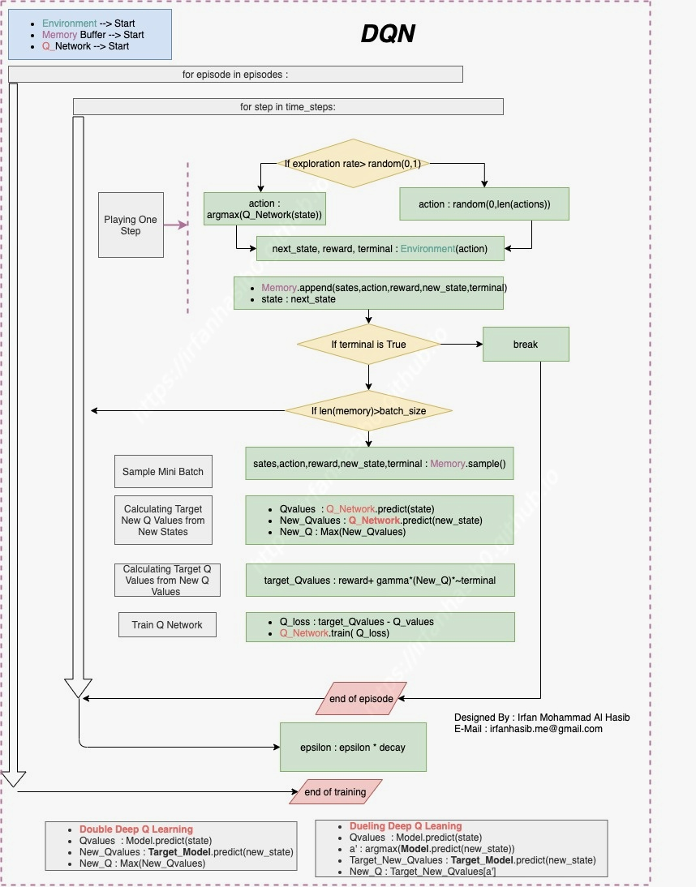
     

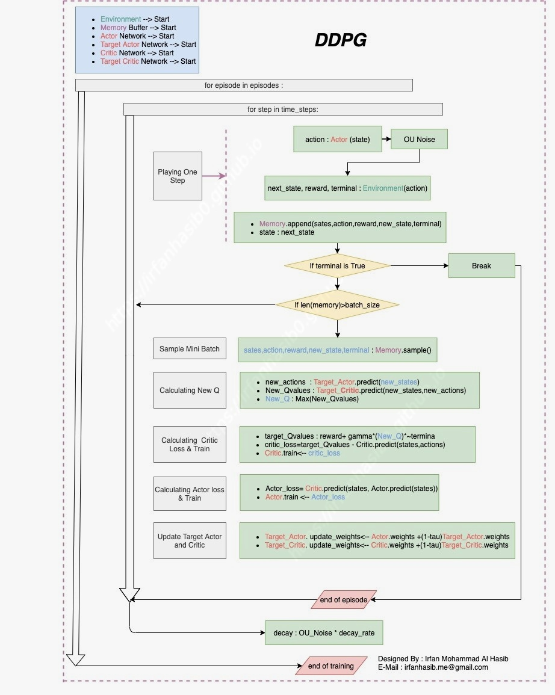</br>

<h3> 3. Results </h3>

* a. Results DQN on Mountain Car (Left):
* b. Results DDPG on Pendulum (Right):
* c. Tset DQN on Mountain Car (Left):
* d. Test DDPG on Pendulum (Right):

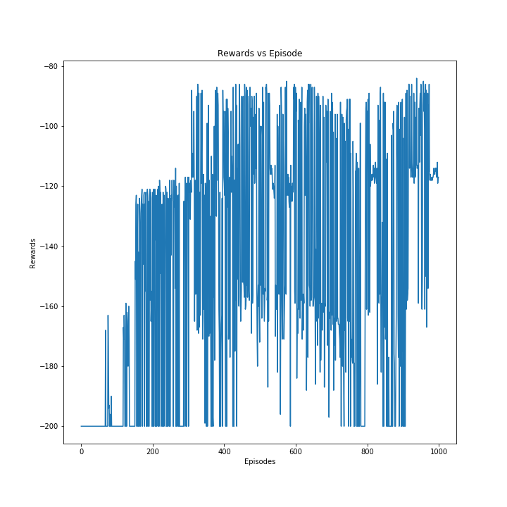
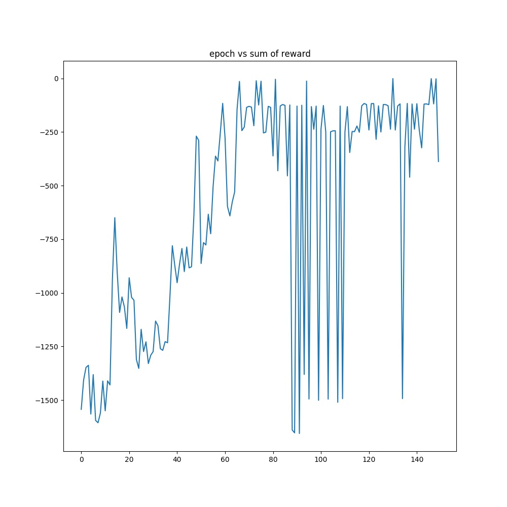
     
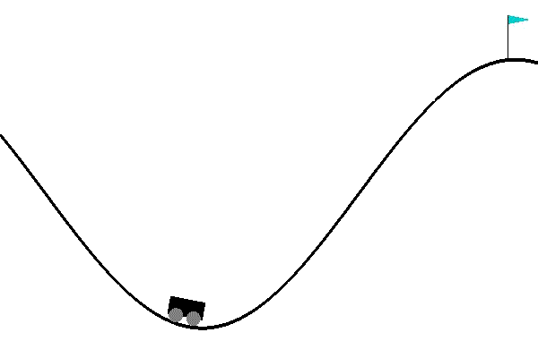
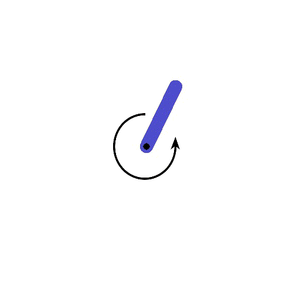
     
<a style="color:navyblue;font-size:15px;" 
href ='#table_of_content_link'>Go Back to Table of Content</a>

<div>
<br><h1  style="color:grey;" >
<a id="yolo_link"></a> 
   Yolo with KERAS and Tensorflow for numberplate detection</h1></br>
<br><a style="color:navyblue;font-size:25px;" href= https://github.com/irfanhasib0/CNN-Projects/blob/master/Yolo_NET_V_1.ipynb> Notebook : Yolo-V3 </a></br>
<a style="color:navyblue;font-size:25px;" href= https://github.com/irfanhasib0/CNN-Projects/blob/master/VGG_NET_V_1.ipynb> Notebook : Yolo with VGG16 </a>
</div>

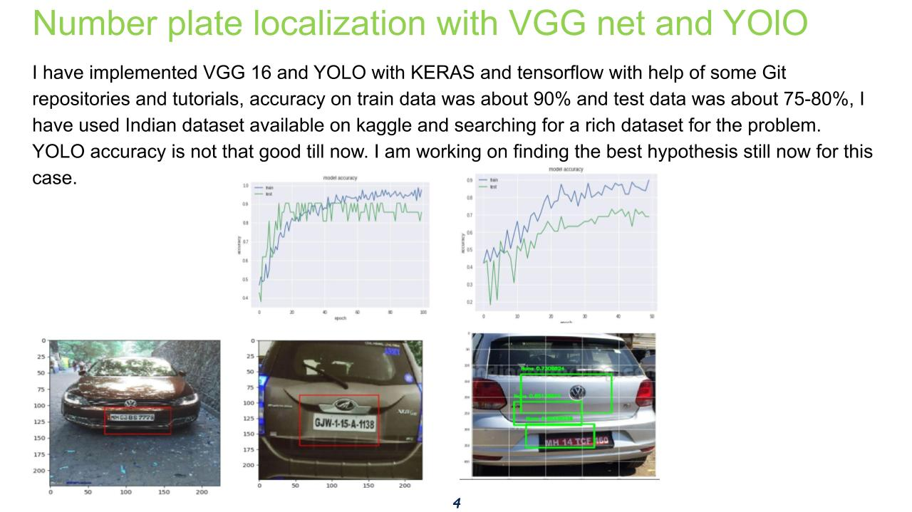

<div>
<br><h1  style="color:grey;" >
<a id="unet_link"></a> 
   Unet with KERAS for City Space Dataset</h1></br>
<br><a style="color:navyblue;font-size:25px;" href= https://github.com/irfanhasib0/CNN-Projects/blob/master/as_unet_seg-cs.ipynb> Notebook :Unet for segmenting City Space Dataset </a></br>

</div>

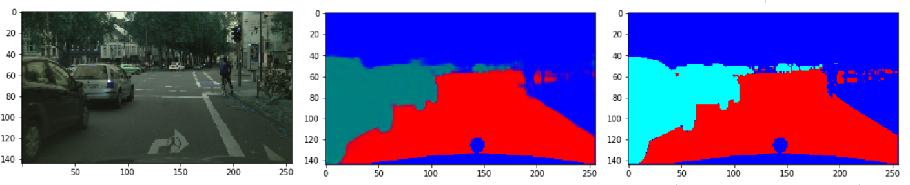
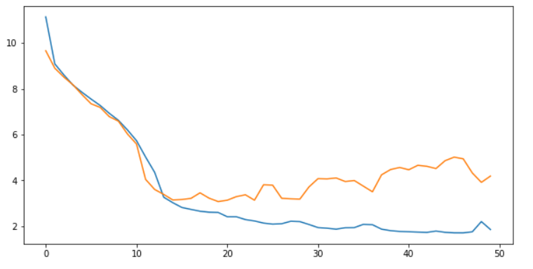
 <a style="color:navyblue;font-size:15px;" 
href ='#table_of_content_link'>Go Back to Table of Content</a>    

<div>
<br><h1  style="color:grey;" >
<a id="ros_rrbot_link"></a> 
   ROS : Simple two linked robot inspired from rrbot</h1></br>
<br>
</div>

- URDF Link(https://github.com/irfanhasib0/ros_ws/tree/master/src/rrbot/rrbot_description)
- Controller Link(https://github.com/irfanhasib0/ros_ws/tree/master/src/rrbot/rrbot_control)
- Gazebo Link(https://github.com/irfanhasib0/ros_ws/tree/master/src/rrbot/rrbot_gazebo)
- Vedio Link (https://youtu.be/lJbyy89X7gM)


<div>
<br><h1  style="color:grey;" >
<a id="pi_project_link"></a> 
   Embedded System Projects : Pi Labs BD LTD</h1></br>
<br>
</div>


All these projects I did as an employee of Pi Labs BD Ltd. www.pilabsbd.com
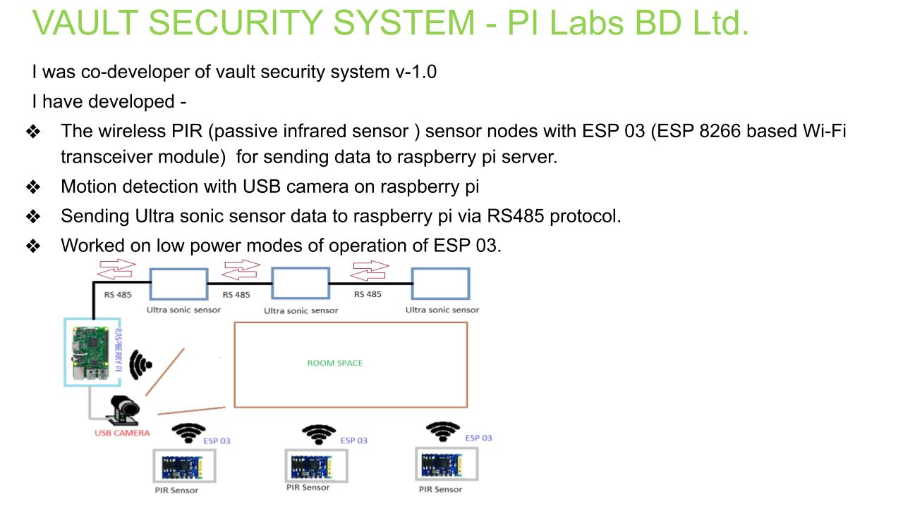
     
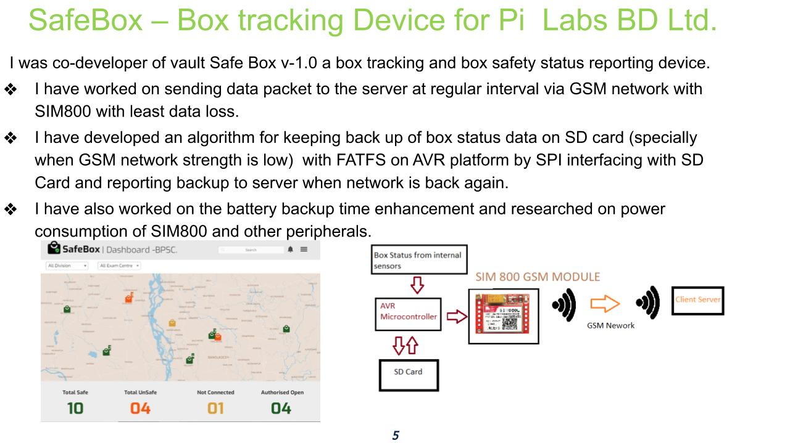
     
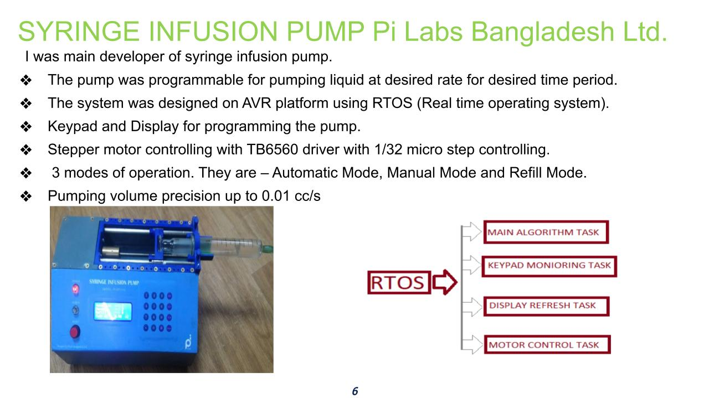
     
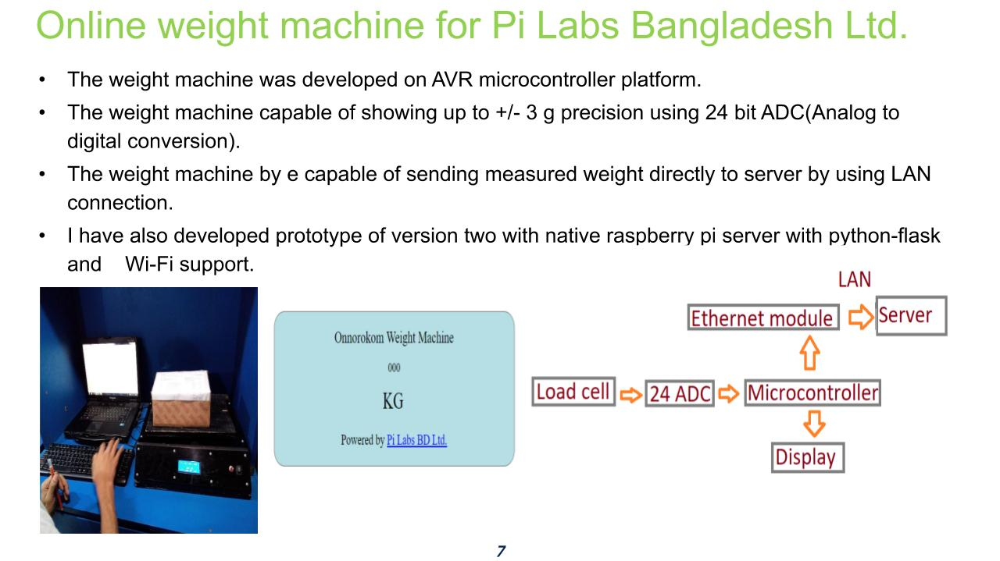


<div>
<br><h1  style="color:grey;" >
<a id = "buet_project_link"></a> 
   Academic Project and Thesis:</h1></br>
<br>
</div>

* My undergrad project of intrumentation and measurement course
* My undergrad thesis

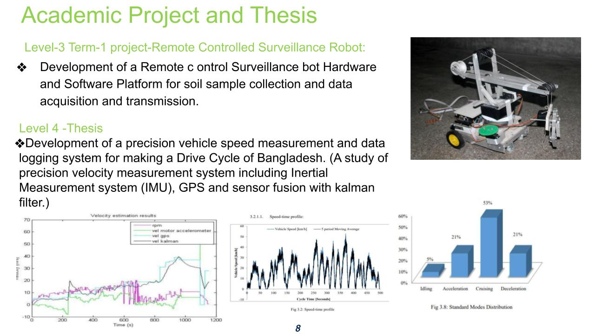


<a style="color:navyblue;font-size:15px;" 
href ='#table_of_content_link'>Go Back to Table of Content</a>

<div>
<br><h1  style="color:grey;" >
<a id = "urc_2016_link"></a> 
   University Rover Challenge - 2016</h1></br>
<br>
</div>

### Critical Design Rivew    : [Video Link](https://www.youtube.com/watch?v=MlN-VFj14LE)

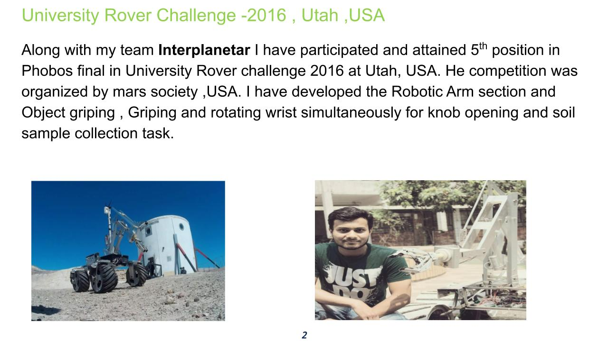

<a style="color:navyblue;font-size:15px;" 
href ='#table_of_content_link'>Go Back to Table of Content</a>


```python

```
