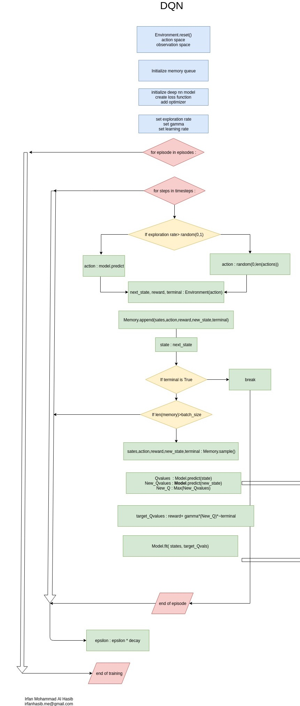
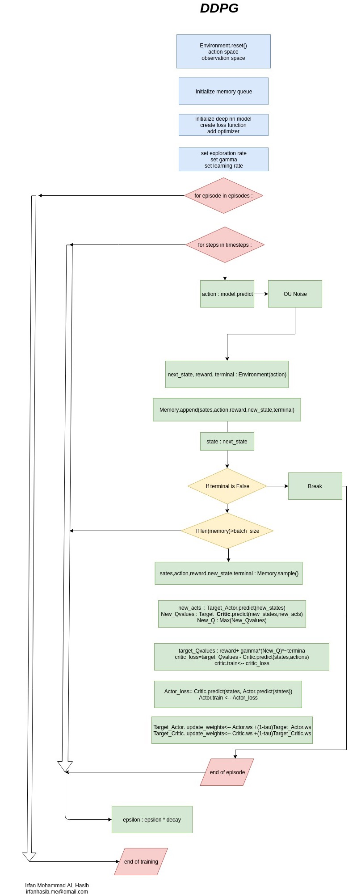

Table of Content
===============================

##### Note :
__In this document for projects are shown as :__
   
   - Link of Jupyter Notebook with implementation code and detail description.
   - Flowchart of the project.
   - Result vedio / gif / graphs.
   - The no of star after every project means the level of documentation.
   
__For detail description and Code please go to the Notebook link Provided for every project!!__
   

### Kaggle Competetions and Job Entrance Problem :
 - [House Price Prediction :: Data Pre-Processing, ANN with tensorflow low level API and and Hiper-Parameter Tuning.  (****)](#house-price-prediction--data-pre-processing-and-hiper-parameter-tuning)
 - [Japanese Job Entrance Problem :: Shakura Bloom Prediction (***)](#japanese-job-entrance-problem--shakura-bloom-prediction)

### Machine Learning Algorithms from Scratch :

 - [Neural Network         :: Implementation from scratch with raw python (**)](#neural-network--nn-implementation-from-scratch)
 - [Decision Tree(ID3)     :: Implementation from scratch with continuous feature support. (****)](#decision-tree--id3-implementation-from-scratch)
 - [Naive Bayes            :: Implementation for text classification with text preprocesing from scratch (**)](#naive-bayes--implementation-for-text-classification)

### Reinforcement Learning ALgorithms from scratch :
 - [DQN(Deep Q Learning) from scratch with Tensorflow-KERAS(**)](#dqn-and-ddpg-implementation-from-scratch)
 - [DDPG(Deep Deterministic Policy Gradient) from scratch with Tensorflow(**)](#dqn-and-ddpg-implementation-from-scratch)
 
### Control Algorithms Implementation from scratch :
- [ILQR(Iterative Linear Quadratic Regulator) Implementation from scratch(****)](#ilqr-and-mpc--implementation-from-scratch-for-self-driving-car-simulator)
- [MPC(Model Predictive Controller) Implementation from scratch(**)](#ilqr-and-mpc--implementation-from-scratch-for-self-driving-car-simulator)

### CNN Projects : (Minimal Doccumentation)
- [Yolo with KERAS and Tensorflow for car number plate localization](#yolo-with-keras-and-tensorflow-nuberplate-detection)
- [Unet with KERAS for City Space Dataset](#unet-with-keras-for-city-space-dataset)

### ROS Project : (Not well doccumented)

- [ROS : Simple two linked robot inspired from rrbot(-)](#ros--simple-two-linked-robot-inspired-from-rrbot)
- [ROS : Writing a script for driving husky robot and getting feed back]

### International Robotics Compititions 

- [University Rover Challenge - 2016](#university-rover-challenge-2016)

### Embedded System Projects for Pi Labs BD Ltd :
 - Vault Sequirity : IOT based Vault sequitrity System with AVR Microcontroller
 - Safe Box : GPRS based Tracking System with AVR Microcontroller
 - Syringe Pump : RTOS Progmable Infusion Pump with AVR Microcontroller
 - Digital Weight Machine : Server based digital wight Machine with AVR Microcontroller
 - [Link of presentation.](#embedded-system-projects--pi-labs-bd-ltd)

### Academic Project and Thesis (Undergrad) :
 - Remote rescue robot with AVR Microcontroller
 - Car velocity mseasuring system for drive cycle of Dhaka
 - [Link of presentation.](#academic-project-and-thesis)

House Price Prediction :: Data Pre-Processing and Hiper-Parameter Tuning
==================================================================================================
### Notebook : [House Price Prediction - Notebook (Project Presentation and Code Link) ](https://github.com/irfanhasib0/Machine-Learning/blob/master/Kaggle/ANN_Tensorflow__Kaggle_Houseprice_prediction.ipynb)

### Overview :
<details open>
    <summary><b><I> Click to toggle expand view</I></b></summary>
    
<ul>
<li><b> Dataset : House Price Dataset of kaggle.com </b></li>
<li><b>  Data is preprocessed : </b></li>
            <ul>
            <li> 2.0 Correlation Analysis </li>
            <li> 2.1 Outlier handling </li>
            <li> 2.2 Missing value Handling </li>
            <li> 2.3 Catagorical to numerical conversion </li>
            <li> 2.4 Unskewing while needed </li>
            <li> 2.5 Data scaling </li>
            </ul>
<li><b> ANN Class with tensorflow low level API : </b></li>
            <ul>
            <li> Method train </li>
            <li> Method predict </li>
            <li> Method save weights </li>
            <li> Method load weights </li>
            </ul>
<li><b> Each preprocessing step's effectiveness is checked by simple linear regression </b></li>
<li><b> Hiperparameter Tuning : </b></li>
            <ul>
            <li> 4.1 Layer Optimization </li>
            <li> 4.2 Optimizer grid search (Each optimizer for learning rates and epochs) </li>
            <li> 4.3 Learning Rate Optimization </li>
            <li> 4.4 Epochs, Early stopping, Regularization constan optimization </li>
            <li> 4.5 Activation optimazation </li>
            <li> 4.6 Batch size optimization </li>
            </ul>
<li> Cross-Validation with 3 fold was done for overfitting testing </li>
<li> Test result was submitted in kaggle.com for evaluation screenshot can be found at result section </li>
<li> All the graphs of Data preprocessing and Hiperparameter Tuning can be found in [Notebook](https://github.com/irfanhasib0/Machine-Learning/blob/master/Kaggle/ANN_Tensorflow__Kaggle_Houseprice_prediction.ipynb). </li>

</ul>
    
</details>
 
### 1.0 Project Flow Chart :


### Cross validation(MSLE) and Kaggle Result(RMSLE)

</br>
     

 

Japanese Job Entrance Problem :: Shakura Bloom Prediction
==================================================================================================

### Notebook : [Shakura Bloom Prediction - Notebook (Project Presentation and Code Link)](https://github.com/irfanhasib0/Machine-Learning/blob/master/Kaggle/Sakura_TF_NN_Report.ipynb)
### Overview

<details open>
    <summary><b><I> Click to toggle expand view</I></b></summary>
<ul>    
<li><b> Dataset : </b></li> Weather data from japanese meteorological agency
<li><b> Steps :</b></li>
                 <ul>
                 <li> Feature Analysis and Data Preprocessing </li>
                 <li> Implementing Nural Network with tensorflow low level API. </li>
                 <li> Hiper-Parameter Tuning for ANN </li>
                 </ul>
<li><b> Data Preprocessing : </b></li>
         <ul>
         <li><b> Converting features of a whole year(365/366 samples) to a single vector for adding feature vector.  </b></li>
                    <ul>
                     <li>  Converting all the 365 days daya to a single feature</li>
                        <ul>
                        <li> 1. Days after bloom can be ignored. As weather before bloom can effect blooom date </li>
                        <li> 2. Days days before Dj- 'Last day of hibernation' is less significant </li>
                        <li> 3. Feature with high correlation i.e max temp, hr1 preci can be specially considered for processing </li>
                        </ul>
                        <li>  Converting all the 365 days daya to a single feature </li>
                         <ul>
                         <li> 1. Mean of first 90 days </li>
                         <li> 2. Mean of 30-90 th days </li>
                         <li> 3. mean of Dj-Dj+45 days </li>
                         <li> 4. Mean Dj-Dj+60 days </li>
                         <li> 5. Mean of Dj-Dj+75 </li>
                         </ul>
                     </ul>
        <li><b> Feature Selection </b></li>
               <ul>
               <li> Co-relation analysis </li>
               <li> Accuracy of the linear regression after adding each feature </li>
               </ul>
       <li><b> Highly Corelated feaure specially anayzing and processing.  </b></li>
       <li><b> Outlier analysis.  </b></li>
       <li><b> Scaling the data considering interquantile range  </b></li>
       </ul>
    
<li><b> Hiperparameter Tuning : </b></li>
             <ul>
             <li> 1. Layer Optimization </li>
             <li> 2. Optimizer grid search (Each optimizer for learning rates and epochs) </li>
             <li> 3. Learning Rate Optimization </li>
             <li> 4. Epochs, Early stopping, Regularization constant optimization. </li>
             </ul>
</ul>    
</details>

### 1.0 Project Flow Chart :

     
### Cross Validation R2 Score :
</br>


Neural Network :: NN Implementation from scratch
================================================
### Notebook : [NN Implementation from scratch - Notebook (Project Presentation and Code Link) ](https://github.com/irfanhasib0/Machine-Learning/blob/master/Machine_Learning_Algo_From_Scratch/ANN_From_Scratch_modular_class.ipynb)

### Overview : 

    
   Here I implemented Neural Network of 3 Layers. I have implemented A Layes Class and functions 
   for Forward propagation,backward propagation and updating weights. I just tested it XOR data.
   It was fitting good.

<details open>
    <summary><b><I> Click to toggle expand view</I></b></summary>
<ul>   
   <li><b> Forward Propagation : </b></li>
          <ul>
          <li> Output of a neuron : Z = W*X + B , Mentioned as Neuron Output </li>
            <ul>
            <li> W(a,b) a for current layer, b for previous layer </li>
            <li> Layer2:Z1 = Layer2:W11 * X_layer1_node1 + Layer2:W21 * X_layer_node_2 + Layer2:Bias </li>
            <li> Layer2:Z2 = Layer2:W11 * X_layer1_node1 + Layer2:W21 * X_layer_node_2 + Layer2:Bias </li>
            </ul>
          <li> Adding Non-Linearity : A = Activation(Z) [ Act(Z) in the flow chart] , Mentioned as Activation Output. </li>
          </ul>
          (For detail better under understanding mutual weight indexing W(a,b) see appendix on Nodes)
          
          
<li><b>  Calulating gradients : </b></li>
          <ul>          
          <li> Calculatin dE/dW (dE/dW : grad of error wrt each weights ) </li>
             <ul>
             <li> dE/dW = dE/dA * dA/DZ * dZ/dw 
             </ul>
          <li> Calculatin dE/dA  (dE/dA : grad of error wrt each Activation output ) </li>
                <ul>
                <li>dE/dA : For Last Layer, if loss function is mean square error, then E = 1/2*(Y - A)^2 so , dE/dA = (A-Y </li>
                <li> dE/dA : For Other Layers dE/dA will be inherited from the each of the node of next layer acccording
                to mutual weights. </li>
                <li> Layer2:Error1 = layer3:Error1 * Layer3:W11 + Layer3:Error2 * Layer3:W21 </li>
                <li> Mathmetically Implmented as Error_l2 = Weights_l3.Transpose() * Error_l3 </li>
                </ul>
          <li>Calculating dA/dZ (dA/dZ : grad of Activation Output wrt each Neuron output  also mentioned as delta here) </li>
                <ul>
                <li> It is just Derivative of sigmoid function in my case : delta = A*(1-A)
                </ul>
          <li> Calculating dZ/dW (dZ/dW : grad of Neuron Output wrt each weights ) </li>
                 <ul>
                 <li> As Z = W*X +B so dZ/dW = X , where for first layer, X is the input  </li>
                 <li> For other layers, the output from previous layer. </li> 
                 </ul>
          </ul>
    
<li><b>  Updating Weights: </b></li>
    <ul>
    <li> Updating each weights W = W + alpha*dW/dE </li>
    <li> Here alpha is the learning rate. </li>
    </ul>  
<li><b> Note : </b></li> In the flowchart Gradient calcultion is shown in back propagation.

</ul>
</details>

### Process Flow Chart :

    (Open Image in new tab for full resolution)


#### Result : 
     Result of ANN implementation for XOR data - mean sqaure error vs epoch -


#### Appendix :
* __Nodes :__
         
         - Every Node/Neuron is considered to have weights for each of previous layers node.
         
         ```
         Leyer 1 ->2 nodes 
         Layer 2 ->3 Nodes
         So, Layer 2's each of the 3 Nodes will have two weights for Layer 1's each of the 2 nodes.
         they are -
         Layer 2 - Node 1: W11 , W12
         Layer 2 - Node 2: W21 , W22
         Layer 2 - Node 3: W31 , W32
         Value of Layer 2:Node1 (Z21) = X1 * Layer2:W11 + X2 * Layer2:W12
         Mutual Weights: Layer:W(a,b) : 
             a is the node we are calculating for (current layer)
             b is the contributing node (from previous layer)
             i.e 
              Layer2:W12 --> Layer 2's 1st node's weight for previous layers(Layer 1) 2nd node
              Layer2:W13 --> Layer 2's 1st node's weight for previous layers(Layer 1) 3rd node
         
         ```
.

Decision Tree :: ID3 Implementation from scratch
====================================================
### Notebook : [ID3 Implementation from scratch - Notebook (Project Presentation and Code Link) ](https://github.com/irfanhasib0/Machine-Learning/blob/master/Machine_Learning_Algo_From_Scratch/ID3_with_continuous_feature_support_exp.py)

* __Dataset     :__ Titanic and irish dataset was used for testing ID3.
* __Steps       :__
                  -Continuous data spliting based on information gain.
                  -Information Gain Calculation Function.
                  -ID3 Algorithm according to flowchart.


* __Tuning     :__ Reduced Error Pruining.
* __Prediction :__ Accuracy,Precision,Recall Reporting.
 
 ### ID3 Flow Chart of Implementation (Open Image in new tab for full resolution)


 #### Result of ID3 implementation for iris data - a.Precision Recall and Accuracy and b.True Label vs Prediction -


 #### Result of ID3 implementation for Titanic data - a.Precision Recall and Accuracy and b.True Label vs Prediction


.

Naive Bayes :: Implementation for text classification
==========================================================

### Notebook : [Naive Bayes Implementation from scratch - Notebook (Project Presentation and Code Link) ](https://github.com/irfanhasib0/Machine-Learning/blob/master/Machine_Learning_Algo_From_Scratch/Naive_Bayes_Stack_Exchange.ipynb)

* Archived data from stack exchange is used for classification.
* Text Preprocessing was done with raw python without nltk.
	Naive Bayes algorithm applied on the procesed text.


* Result of Naive Bayes implementation for Stack Exchange data - a.Precision Recall and Accuracy and b.True Label vs Prediction


ILQR and MPC :: Implementation from scratch for self driving car simulator
=============================================================

### Notebook : [ILQR Implementation - Notebook (Project Presentation and Code Link)](https://github.com/irfanhasib0/RL-Algorithms/blob/master/DDPG_Pendulum_TF-V-2-ROS.ipynb)


 
### Overview :

<details open>
    <summary><b><I> Click to toggle expand view</I></b></summary>
<ul>
 
<li><b>  Simulation Environment : </b></li>
    <ul>
    <li> AIRSIM a Car Simulator by Microsoft </li>
    <li> OpenAI gym Car ENnvironment. </li>
    </ul>
<li><b> Original Paper of ILQR Part of the Project </b></li>
                    
                    Synthesis and Stabilization of Complex Behaviors through Online Trajectory Optimization By - Y Tassa  
<li><b>  I0 :   </b></li>
                    
                    Input --> Map Points , Output --> Steering Angle, Acclelation, Brake
<li><b>  Steps :  </b></li>
                 <ul>
                 <li> Map Tracker Module </li>
                         <ul>
                         <li> Input : Takes Map points as Input
                         <li> Trajectory Queue : Gets N next points from map points to follow according to car position and orientation.
                         <li> Update Trajectory Queue : Update the queue of points to follow with moving car position and orientation.
                         <li> Output : Next N points to follow from Trajectory Queue
                         </ul>
                <li> Data Preprcessor Module : </li>
                         <ul>
                         <li> Input : Trajectory points from Map tracker module.
                         <li> Full State Calculation : Calculates yaw from ref points and target velocity.
                         <li> Relative Trajectory calculation : Relative Co-ordinates calculation as Car position nad yaw as                         origin.
                         <li> Output : Adjusts no of points to track in the refference trajectory accrding to current velocity.  
                         </ul>
                 <li> ILQR Module </li>
                          <ul>
                           <li> Input : Refferance trajectory to follow from Data Processor module. </li>
                          <li> Output : Calculate Optimal steering angle and accelaration with ILQR algorithm shown below. </li>
                          </ul>
                 OR,
                 <li> MPC Module</li>
                              <ul>
                              <li> Input : Refferance trajectory to follow from Data Processor module. </li>
                              <li> Output : Calculate Optimal steering angle and accelaration with MPC algorithm shown below. </li>
                              </ul>
                 </ul>
</ul>    
    
</details>
     
### 1.0 Project Flow Chart :


     
#### Results (ILQR) :
* OpenAI Gym Car Environment 
* Airsim City Space Environment 
* Airsim Neighbourhood Environment 


#### Appendix : Map Tracker 

     
     


DQN and DDPG:: Implementation from scratch
======================================

### Notebook : [Mountain Car with DQN - Notebook (Project Presentation and Code Link)](https://github.com/irfanhasib0/RL-Algorithms/blob/master/Deep_Q_Learning_mc.ipynb)
 
### Notebook : [Pendulum with DDPG - Notebook (Project Presentation and Code Link)](https://github.com/irfanhasib0/RL-Algorithms/blob/master/Deep_Q_Learning_mc.ipynb)

* __DQN Environments :__ OpenAI gym --> Mountain Car ENvironment
* __DDPG Environments :__ OpenAI gym --> Pendulumn Environment
 
                 
### 1.0 Project Flow Chart for DQN and DDPG :


     

</br>
     

### Results 
* a. Results DQN on Mountain Car (Left):
* b. Results DDPG on Pendulum (Right):
* c. Tset DQN on Mountain Car (Left):
* d. Test DDPG on Pendulum (Right):


     


     
     


Yolo with KERAS and Tensorflow for numberplate detection
========================================================

### Notebook : [Yolo V3](https://github.com/irfanhasib0/CNN-Projects/blob/master/Yolo_NET_V_1.ipynb)

### Notebook : [Yolo with VGG16](https://github.com/irfanhasib0/CNN-Projects/blob/master/VGG_NET_V_1.ipynb)


Unet with KERAS for City Space Dataset
========================================================
### Notebook :[Unet for segmenting City Space Dataset](https://github.com/irfanhasib0/CNN-Projects/blob/master/as_unet_seg-cs.ipynb)


     

ROS : Simple two linked robot inspired from rrbot
=========================================
- URDF Link(https://github.com/irfanhasib0/ros_ws/tree/master/src/rrbot/rrbot_description)
- Controller Link(https://github.com/irfanhasib0/ros_ws/tree/master/src/rrbot/rrbot_control)
- Gazebo Link(https://github.com/irfanhasib0/ros_ws/tree/master/src/rrbot/rrbot_gazebo)
- Vedio Link (https://youtu.be/lJbyy89X7gM)


Embedded System Projects : Pi Labs BD LTD
=====================================

All these projects I did as an employee of Pi Labs BD Ltd. www.pilabsbd.com

     

     

     


Academic Project and Thesis:
=========================

* My undergrad project of intrumentation and measurement course
* My undergrad thesis


 
 University Rover Challenge - 2016
 ==========================

### Critical Design Rivew    : [Video Link](https://www.youtube.com/watch?v=MlN-VFj14LE)


```python

```
