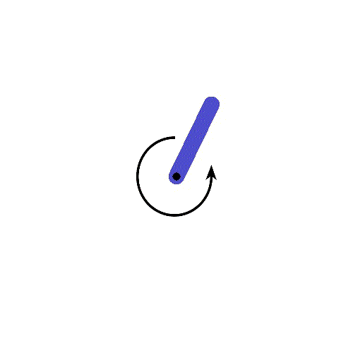
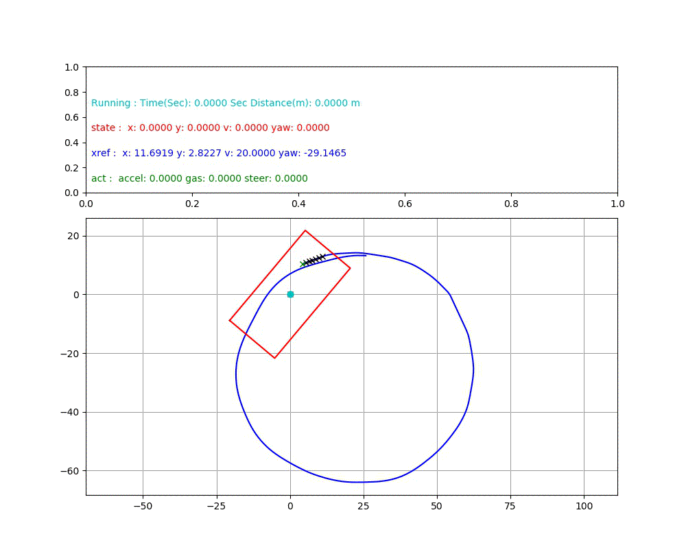
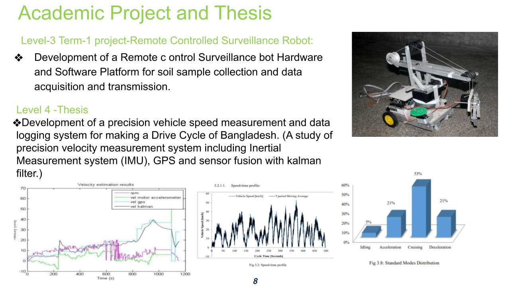

<script async defer src="https://buttons.github.io/buttons.js"></script>
<meta name="viewport" content="width=device-width, initial-scale=1">
<link rel="stylesheet" href='styles_1.css'>
<link rel="stylesheet" href='styles_2.css'>
<a id="table_of_content_link"></a> 
<div id="div_1"> 
   <!--I>I am Irfan, currently (2024) working as an AI Engineer in Japan. I always seek to learn something new, enthusiastic about - Artificial Intelligence, Computer Vision, Machine Learning and Robotics etc. Some of my works in these fields are organized in this page. Python, C++, little bit of React (js) is mosly used in these works. The detailed algorithms code and results for each project is demonstrated below in respective sections. I have designed the flowcharts to precisely demonstrate how each of these algorithms work. Some people may find it redundant but it helps me to dump my knowledge this way. The page has many graphical contents, please be patient while loading.
<I>
 E-mail : <a href="mailto:irfanhasib.me@gmail.com">irfanhasib.me@gmail.com</a>

<h3> Table of Content </h3> 
*Note :  '(FS)' means implementation From Scratch. 'UP' is for underprogress.
<h4> Recent works on Computer Vision on progress ...</h4-->
<iframe src="https://docs.google.com/document/d/e/2PACX-1vQ481PU7TepDQxdvwqh9FBQ5lBpW4FZ_J9tuFkRGiV9RML-JjfGz-iqYfAKoed7HaINMrfW0rAAAUIR/pub?embedded=true"  name="targetframe" display="block" align="top" allowTransparency="true" scrolling="no" frameborder="0px" padding="0px" border="0px"  height="300px" width="100%" ></iframe>
</div>
<div class="row">
<div margin-left='20px' class="column">
<h4> Machine Learning Algorithms (FS)</h4>
<ul id="ul_1">
  <li><a id="a_1" href ='#ann_link'> Neural Network </a></li>
  <li><a id="a_1" href ='#id3_link'> Decision Tree Algorithms</a></li>
  <li><a id="a_1" href ='#svm_link'> SVM, Logistic Regression</a></li>
  <li><a id="a_1" href ='#naive_bayes_link'> Naive Bayes, KNN</a></li>
</ul>
</div> 

<div class="column">
<h4> Deep Learning for Computer Vision </h4>
<ul id="ul_1">
  <li><a id="a_1" href ='#yolo_link'> Yolo-V4 : Object Detection </a></li>
  <li><a id="a_1" href ='#unet_link'> Unet : Semantic Segmentation </a></li>
  <li><a id="a_1" href ='#flownet_link'> FlowNet : Optical Flow Estimation </a></li>
  <li><a id="a_1" href ='#disp_link'> Disparity Estimation </a></li>
</ul>
</div> 
    
<div class="column">
<h4> Reinforcement Learning Algo. (FS)  </h4>
<ul id=ul_1>
  <li><a id="a_1" href ='#dqn_ddpg_link'> DQN </a></li>
  <li><a id="a_1" href ='#dqn_ddpg_link'> DDPG </a></li>
  <li><a id="a_1" href ='#dqn_ddpg_link'> PPO </a></li>
  <li><a id="a_1" href ='#dqn_ddpg_link'> A2C </a></li>
</ul>
</div> 
</div> 

<div class="row">
<div class="column">
<h4> Personal Acievements </h4>
<ul id="ul_1">
  <li><a id="a_1" href ='#urc_2016_link'> Mars Rover Challenge (USA, Utah), 2016</a></li>
  <li><a id="a_1" href='https://irfanhasib0.github.io/research.html'> Journal Paper on auxiliary task guidance., 2023</li>
  <li><a id="a_1" href='https://irfanhasib0.github.io/research.html'> Pre-print paper on sparse gradient reinforcement, 2024</li>
</ul>
</div>

<div class="column">
<h4>Professional AI Projects </h4>
 <ul id="ul_1">
 <li><a id="a_1" href ='#ai_project_link_1'>Process control automation (AI) </a></li>
 <li><a id="a_1" href ='#ai_project_link_2'>Optimal shiping plan selection (AI) </a></li>
 <li><a id="a_1" href ='#ai_project_link_3'>Early prediction Production of KPI (DL)</a></li>
 <li><a id="a_1" href ='#ai_project_link_4'>Production Dynamics visualization (ML)</a></li>
</ul>
</div>

<div class="column">
<h4>Professional Embedded System Projects </h4>
 <ul id="ul_1">
 <li><a id="a_1" href ='#pi_project_link_1'> Vault Sequirity System </a></li>
 <li><a id="a_1" href ='#pi_project_link_2'> Programmable Syringe Infusion Pump </a></li>
 <li><a id="a_1" href ='#pi_project_link_3'> GPRS based Monitoring System </a></li>
 <li><a id="a_1" href ='#pi_project_link_4'> Online digital weights machine </a></li>
</ul>
</div>
</div>

<div class="row">
<div class="column">
<h4> Control Algorithms from scratch (FS)  </h4>
<ul id="ul_1">
  <li><a id="a_1" href ='#ilqr_mpc_link'> ILQR </a></li>
  <li><a id="a_1" href ='#ilqr_mpc_link'> MPC </a></li>
</ul>
</div>
    
<div class="column">
<h4> Feature Engineering and Model Tuning  </h4>
<ul id="ul_1">
  <li><a id="a_1" href ='#house_price_link'> Kaggle House Price Prediction.</a></li>
  <li><a id="a_1" href ='#sakura_link'> Shakura Bloom Prediction.</a></li>
</ul>
</div>

<div class="column">
<h4> ROS & Robotics </h4>
<ul id="ul_1">
  <li><a id="a_1" href ='#ros_rrbot_link_1'> ROS : Simple two linked robot</a></li>
  <li><a id="a_1" href ='#ros_rrbot_link_2'> ROS : Husky and URbot(UR5) robot driver</a></li>
</ul>
</div>
</div>


<div class = "row">
<div class="column">
<h4> Academic Project and Thesis (Undergrad) </h4>
<ul id="ul_1">
 <li><a id="a_1" href ='#buet_project_link'>Remote rescue robot </a></li>
 <li><a id="a_1" href ='#buet_project_link'>GPS, IMU data Fusion for precision velocity </a></li>
</ul>
</div>


<div class="column">
<h4> Robotics Projects Personal (Undergrad) </h4>
<ul id="ul_1">
 <li><a id="a_1" href ='#embedded_project_link_1'> Desktop CNC Machine(2014) </a></li>
 <li><a id="a_1" href ='#embedded_project_link_2'> GUI software for Robotic ARM(2014) </a></li>
 <li><a id="a_1" href ='#embedded_project_link_3'> Visually Instructed Robotic ARM(2013) </a></li>
</ul>  
</div>
    
<div class="column">
</div>
</div>

<div>
<a id="ann_link"></a> 
<h1  style="color:grey;" > Neural Network Implementation from scratch</h1></br>
<a id="a_1" href ='#table_of_content_link'>Go Back to Table of Content</a>

<ul id="ul_1">
    <b><I>
    <li>Section 1: Overview </li>
    <li>Section 2. Flowchart</li>
    <li>Section 3. Code </li>
    <li>Section 4. Result</li>
    </b></I>
</ul>


<div id=div_style>
<h3> 1. Overview :  </h3><br>
<p>A simple multi layer neural network is implemented here from scratch, using raw Python programming language. I preffered OOP for encapsulation and pproper organization. Layer object are the backbone of this implementation while Network object used to organize it all together. A stack of Layer objects can be used to build a Network. Network object has the following fucntions(1) Layer :: "forward_propagation", (2) Layer :: "backward_propagation", (3) Layer :: "update_weights" </b></I>. I have tested it with Banknote dataset. It was fitting good. Result can be found in Results section</p>
</div>

<h3> 2. Flow Chart (ANN) : (Open Image in new tab for full resolution)</h3>


<!-- Place this tag where you want the button to render. -->
<a class="github-button" href="https://github.com/irfanhasib0/Machine-Learning" data-icon="octicon-star" aria-label="Star irfanhasib0/Machine-Learning on GitHub">Star</a>
<h3> 3. Implementation Code : </h3>
<a style="color:royalblue;font-size:15px;" href= https://github.com/irfanhasib0/Machine-Learning/blob/master/Machine_Learning_Algo_From_Scratch/ANN_From_Scratch_modular_class-V1.0.ipynb> GitHub : NN Implementation from scratch - Notebook </a>
<iframe src="code/ANN.html" name="targetframe" allowTransparency="true" scrolling="yes" frameborder="0" height="300" width="100%" ></iframe>

<h3> 4. Result of ANN implementation for Bank Note data- a.Precision, Recall and Accuracy and b.True Label vs Prediction </h3>


<h1  style="color:grey;" >
<a id="id3_link"></a> 
   Descision Tree Implementation from scratch</h1>
<a id="a_1" 
href ='#table_of_content_link'>Go Back to Table of Content</a>

<ul id="ul_1">
    <b><I>
    <li>Section 1: Summary </li>
    <li>Section 2: Flowchart </li>
    <li>section 3: Code </li>
    <li>Section 4:Result (Results can be found after code demonstration for each algorithm) </li>
    </b></I>
</ul>

<h3> 1. Overview </h3></br>
<div id=div_style>
 A fundamental descision tree based classifier is implemented here using ID3 algorithm with Python from scratch. Titanic and irish dataset was used for testing the algorithm. Function for (1) Continuous data spliting based on information gain, (2) Information Gain Calculation,  (3) ID3 Algorithm (4) Prediction from the built tree, are main part of the implementation. For preventing overfitting reduced error pruining was applied. Accuracy,Precision,Recall is reported in Result section.
</div>

<h3> 2. ID3 Flow Chart of Implementation (Open Image in new tab for full resolution) </h3>


<!-- Place this tag where you want the button to render. -->
<a class="github-button" href="https://github.com/irfanhasib0/Machine-Learning" data-icon="octicon-star" aria-label="Star irfanhasib0/Machine-Learning on GitHub">Star</a>

<h3> 3. ID3 Implementation Code </h3>
<a style="color:royalblue;font-size:15px;" href= https://github.com/irfanhasib0/Machine-Learning/blob/master/Machine_Learning_Algo_From_Scratch/ID3_with_continuous_feature_support-V1.0.ipynb>GitHub : ID3 Implementation from scratch - Notebook</a>

<iframe src="code/ID3.html" name="targetframe" allowTransparency="true" scrolling="yes" frameborder="0" height="300" width="100%" ></iframe>

<h3> 4. Result of ID3 implementation for iris data - a.Precision, Recall and Accuracy and b.True Label vs Prediction - </h3>


<h1  style="color:grey;" >
<a id="svm_link"></a> 
   SVM, Logistic Regression Implementation from scratch</h1>
<a id="a_1" 
href ='#table_of_content_link'>Go Back to Table of Content</a>

<ul id="ul_1">
    <b><I>
    <li>Section 1: Summary </li>
    <li>Section 2: Flowchart (SVM & Logistic Regression) </li>
    <li>section 3: Code (3.1 SVM, 3.2 Logistic Regression) </li>
    <li>Section 4: Result(4.1 SVM ,4.2 Logistic Regression) </li>
    </b></I>
</ul>

<h3> 1. Overview </h3></br>

<div id=div_style>
      SVM and Logisitic Regression code from scratch is presented below. SvmC object with the functions (a) SvnC.predict (b) SvmC.calc_gradients (c) SvmC.update_weights is implemented. LogisticRegression object also have the same functions. Banknote dataset is used for testing both of the algorithms. SVM and LogisticRegression Class is implemented accordingly for the respective algorithms. For each of the 2 class predict, calc loss, calc grads, update weights functions are implemented. Both of the algorithms showed good accuracy for banknote dataset after minimal parameter tuning. Results can be found in respective results section.
</div>

<h3> 2.0 SVM(Left), Logistic Regression(Right) Flow Chart of Implementation (Open Image in new tab for full resolution) </h3>


<h3> 3.1 Implementation Code SVM <h3>
<a style="color:royalblue;font-size:15px;" href= https://github.com/irfanhasib0/Machine-Learning/blob/master/Machine_Learning_Algo_From_Scratch/SVM.ipynb>(a) GitHub : SVM Implementation from scratch - Notebook </a>

<iframe src="code/SVM.html" name="targetframe" allowTransparency="true" scrolling="yes" frameborder="0" height="300" width="100%" ></iframe>
    
<h3> 3.1 Implementation Code Logistic Regression <h3>
<a style="color:royalblue;font-size:15px;" href= https://github.com/irfanhasib0/Machine-Learning/blob/master/Machine_Learning_Algo_From_Scratch/Logistic_Regression.ipynb> (b) GitHub : Logistic Regression Implementation from scratch - Notebook</a>

<iframe src="code/LogReg.html" name="targetframe" allowTransparency="true" scrolling="yes" frameborder="0" height="300" width="100%" ></iframe>


<h3> 4.1 Result of SVM implementation - a.Precision, Recall and Accuracy and b.True Label vs Prediction </h3>


<h3> 4.2 Result of Logitic Regression implementation - a.Precision, Recall and Accuracy and b.True Label vs Prediction </h3>


<h1  style="color:grey;" >
<a id="naive_bayes_link"></a> Naive Bayes and KNN Implementation for text classification</h1></br>
<a id="a_1" href ='#table_of_content_link'>Go Back to Table of Content</a>
</ul>
<ul id="ul_1">
    <b><I>
    <li>Section 1: Overview </li>
    <li>Section 2: Flowchart (Naive Bias & KNN)</li>
    <li>Section 2: Code (3.1 Naive Bias , 3.2 KNN)</li>
    <li>SEction 3: Result (4.1 Naive Bias, 4.2 KNN)</li>
    </b></I>
</ul>
    
<h3> 1. Overview </h3></br>
<div id=div_style>
 The steps for Naive Bias algorithm are as follows - (1) Calculating Attribute(word) Probabilities given each class. (2) Calculating Attribute(word) Probabilities given each Samples. (3) Applying Bayes Theorem for getting class probalities. (4) Max class probality is the predicted label. Algorithm Steps for KNN are - (1) Calculating Attribute Probability vector for each sample (2) Calculating Cosine/Eucleidian/Humming Distances from test sample to each of train sample (3) Taking labels of K min distance samples from train data. Taking mode of K labels as prediction (tie breaks by random choise). The model was Tuned for best alpha values. Archived data from stack exchange is used for testing the implementations. Accuracy,Precision and Recall are reported.
</div>


<h3> 2. (a)Naive Bayes (b)K Nearest Neighbour algorithm Flow Chart</h3>


<h3> 3.1 Implementation Code Naive Bias </h3>
<a style="color:royalblue;font-size:15px;" href= https://github.com/irfanhasib0/Machine-Learning/blob/master/Machine_Learning_Algo_From_Scratch/Naive_Bayes_Stack_Exchange.ipynb> (a) GitHub : Naive Bayes Implementation from scratch - Notebook </a>
 
<iframe src="code/NB.html" name="targetframe" allowTransparency="true" scrolling="yes" frameborder="0" height="300" width="100%" ></iframe>

<h3> 3.2 Implementation Code K Nearest Neighbour </h3>
<a style="color:royalblue;font-size:15px;" href= https://github.com/irfanhasib0/Machine-Learning/blob/master/Machine_Learning_Algo_From_Scratch/KNN_Stack_Exchange.ipynb> (b) GitHub : KNN Implementation from scratch - Notebook</a>


<iframe src="code/KNN.html" name="targetframe" allowTransparency="true" scrolling="yes" frameborder="0" height="300" width="100%" ></iframe>
<h3> 4.1 Result of Naive Bayes implementation - a.Precision Recall and Accuracy b.True Label vs Prediction <h3>
<div class='row'>


</div>

<h3> 4.2 Result of KNN implementation - a.Precision Recall and Accuracy b.True Label vs  Prediction <h3>
<div class='row'>


</div>
<a id="a_1" href ='#table_of_content_link'>Go Back to Table of Content</a>
</div>

<div>
<div>
<a id="yolo_link"></a>
<h1  style="color:grey;"> Yolo-V4.0 with KERAS and Tensorflow for Object detection </h1>
<a id="a_1" href ='#table_of_content_link'>Go Back to Table of Content</a></br>

<ul id="ul_1">
    <b><I>
    <li>Section 1: Overview </li>
    <li>Section 2. Flowchart</li>
    <li>Section 3. Code </li>
    <li>Section 4. Result</li>
    </b></I>
</ul>
</div>

<div id=div_style>
<h3>1. Overview </h3></br>
Yolo V-2.0 is implemented here and tested with COCO dataset. It is one of the SOTA algorithm for object detection. The algorithm is showed in the figure in algorithm section. Python code can be found in code section.
</div>

<div>
<h3>2. Flowchart </h3>    
</br>
</div>

<div>
<h3>2. Code YOLO-V2,V4 for COCO dataset </h3>
</br><a style="color:royalblue;font-size:20px;" href=https://github.com/irfanhasib0/Deep-Learning-For-Computer-Vision/tree/main/yolo-v4> GitHub Link : Yolo V4 </a>
</br><a style="color:royalblue;font-size:20px;" href=https://github.com/irfanhasib0/CNN-Projects/blob/master/CNN_Basic/Minimal_yolo_coco-v-2.0-exp-COCO.ipynb> GitHub Link : Yolo-V2 </a>
<!-- Place this tag where you want the button to render. -->
<a class="github-button" href="https://github.com/irfanhasib0/CNN-Projects" data-icon="octicon-star" aria-label="Star irfanhasib0/CNN-Projects on GitHub">Star</a>

<iframe src="code/yolo_v2.html" name="targetframe" allowTransparency="true" scrolling="yes" frameborder="0" height="300" width="100%" ></iframe>
</div>

<div>
<h3>3. Results: </h3>
<div class="row">
<div class="column">
</br>
</div>
<div class="column">

</div>   
</div>
</div>

<div>
<h1  style="color:grey;">
<a id="unet_link"></a>U-Net with KERAS for City Space Dataset</h1>
<a id="a_1" href ='#table_of_content_link'>Go Back to Table of Content</a></br>

<ul id="ul_1">
    <b><I>
    <li>Section 1: Overview </li>
    <li>Section 2. Network Architecture</li>
    <li>Section 3. Code </li>
    <li>Section 4. Result</li>
    </b></I>
</ul>
</div>

<div id=div_style>
<h3>1. Overview </h3></br>

U-Net is implemented here and tested with CityScapes dataset. It is one of the SOTA algorithm for semantic segmentation. The network architecture is showed in the figure of Network Architecture section. Python code can be found in code section.
</div>

<div>
<h3>2. Network Architecture </h3>

</div>

<div>
<h3>3. Code of U-Net for CityScapes dataset  </h3>
<br><a style="color:royalblue;font-size:20px;" href= https://github.com/irfanhasib0/CNN-Projects/blob/master/CNN_Basic/U-Net_cityscapes.ipynb> GitHub :Unet for segmenting City Space Dataset </a></br>
<iframe src="code/unet_cityscapes.html" name="targetframe" allowTransparency="true" scrolling="yes" frameborder="0" height="300" width="100%" ></iframe>
</div>

<div>
<h3>4. Result </h3>

</div>

<div>
<h1  style="color:grey;" >
<a id="flownet_link"></a> 
  Flow-Net with KERAS and Tensorflow</h1>
<a id="a_1" href ='#table_of_content_link'>Go Back to Table of Content</a></br>

<ul id="ul_1">
    <b><I>
    <li>Section 1: Overview </li>
    <li>Section 3. Code </li>
    <li>Section 4. Result</li>
    </b></I>
</ul>
</div>

<div id=div_style>
<h3>1. Overview </h3></br>

FlowNet is one of the most popular architecture for optical flow prediction. Here the implementation code and results on KITTI Flow Dataset is presented below </h3>
</div>

<div>
<h3>2. Code </h3>
<br><a style="color:royalblue;font-size:20px;" href= https://github.com/irfanhasib0/CNN-Projects/blob/master/CNN_Basic/FlowNetS_KITTI_Flow_Data.ipynb> GitHub Link :FlowNet for Optical Flow Kitti Dataset </a></br>
<iframe src="code/flownets_kitti_flow.html" name="targetframe" allowTransparency="true" scrolling="yes" frameborder="0" height="300" width="100%" ></iframe>
</div>

<div>
<h3>3. Result </h3>
Train GT, Train prediction, Test GT, Test Prediction


     


</div>

<div>
<h1  style="color:grey;" >
<a id="disp_link"></a> 
  Monocular Disparity using KERAS and Tensorflow</h1>
<a id="a_1" href ='#table_of_content_link'>Go Back to Table of Content</a></br> 

<ul id="ul_1">
    <b><I>
    <li>Section 1: Overview </li>
    <li>Section 3. Code </li>
    <li>Section 4. Result</li>
    </b></I>
</ul>
</div>

<div id=div_style>
<h3>1. Overview </h3></br>
    
Slightly modified Architecture of FlowNet is used for monocular depth estimation. It still performed satisfactorily. The implementation code and results on KITTI Flow Dataset(on disp ground truth)  is presented below </h3>
</div>

<div>
<h3> Code </h3>
</br><a style="color:royalblue;font-size:20px;" href=https://github.com/irfanhasib0/CNN-Projects/blob/master/CNN_Basic/FlowNetS_KITTI_Disp_Data.ipynb> GitHub Link : Single View Depth Estimation </a></br>
<iframe src="code/flownets_kitti_disp.html" name="targetframe" allowTransparency="true" scrolling="yes" frameborder="0" height="300" width="100%" ></iframe>
</div>

<div>
<h3> Result </h3>
Top row : Train ; Bottom Row : Validation ;
Left : Ground Truth ; Right : Prediction


     


     
</div>
</div>

<div>
<br><h1  style="color:grey;" >
<a id="dqn_ddpg_link"></a> DQN , DDPG, PPO A2C Implementation from scratch</h1></br>
<a id="a_1" href ='#table_of_content_link'>Go Back to Table of Content</a>

<ul id="ul_1">
    <b><I>
    <li>Section 1: GitHub Code Links </li>
    <li>Section 2: Overview </li>
    <li>Section 3. Flowchart</li>
    <li>Section 4. PPO Code </li>
    <li>Section 5. Result</li>
    </b></I>
</ul>

<h3> 1. GitHub Code Links : </h3>
<ul>
<li><a id="a_1" href= https://github.com/irfanhasib0/RL-Algorithms/blob/master/1.0_Multi_Arm_Bandit.ipynb>  Multi Arm Bandit - Notebook </a></li>
<li><a id="a_1" href= https://github.com/irfanhasib0/RL-Algorithms/blob/master/2.1_Value_Iteration.ipynb>   Value Iteration - Notebook  </a></li>
<li><a id="a_1" href= https://github.com/irfanhasib0/RL-Algorithms/blob/master/3.0_DQN_Mountain_Car.ipynb>  DQN for Mountain Car - Notebook  </a></li>
<li><a id="a_1" href= https://github.com/irfanhasib0/RL-Algorithms/blob/master/4.0_DDPG_Pendulum-mod.ipynb> DDPG for Pendulum - Notebook</a></li>
<li><a id="a_1" href= https://github.com/irfanhasib0/RL-Algorithms/blob/master/5.1_PPO_Bipedal_Walker-mod.ipynb>  PPO for Bipedal Walker - Notebook</a></li>
<li><a id="a_1" href= https://github.com/irfanhasib0/RL-Algorithms/blob/master/5.2_PPO_Lunar_Lander.ipynb>  PPO for Lunar Lander - Notebook </a></li>
</ul>
</div>
<h3> 2.  Overview </h3>

<div id=div_style> 
 DQN implemented and tested on OpenAI gym Mountain Car ENvironment, DDPG implemented and tested on  OpenAI gym Pendulumn Environment, PPO implemented and tested on OpenAI gym Bipedal Walker and Lunar Lander Environment. All these algorithms are implemnted from scratch using TensorFlow, Numpy and Python.
</div>
<div>
<!-- Place this tag where you want the button to render. -->
<a class="github-button" href="https://github.com/irfanhasib0/RL-Algorithms" data-icon="octicon-star" aria-label="Star irfanhasib0/RL-Algorithms on GitHub">Star</a></br>

<h3> 3. Detailed Flow Chart for DQN and DDPG : (Please Zoom or Open in New tab for proper resolution) </h3>

    

     
<!-- Place this tag where you want the button to render. -->
<a class="github-button" href="https://github.com/irfanhasib0/RL-Algorithms" data-icon="octicon-star" aria-label="Star irfanhasib0/RL-Algorithms on GitHub">Star</a>

<h3> 4. Code PPO for bipedal environment </h3>
<iframe src="code/ppo_biped.html" name="targetframe" allowTransparency="true" scrolling="yes" frameborder="0" height="300" width="100%" ></iframe>

<h3> 5. Results </h3>

* a. Results DQN on Mountain Car
* b. Results DDPG on Pendulum 
* c. Results PPO on Bipedal Walker
* d. Results PPO on Lunar Lander


     




     
<a id="a_1" 
href ='#table_of_content_link'>Go Back to Table of Content</a>
</div>


<div>
<br><h1  style="color:grey;" >
<a id="house_price_link"></a> 
    House Price Prediction :: Data Pre-Processing and Hiper-Parameter Tuning</h1></br>
<a id="a_1" href ='#table_of_content_link'>Go Back to Table of Content</a>

<b><I>
<ul>
    <li> Section 1: Overview </li>
    <li> Section 2: Demonstration of Project Code </li>
    <li> Section 3: Flow Chart </li>
</ul>
</b></I>
</div>

<h3> 1. Overview :</h3>
<div id=div_style>
    <ul id=ul_style>
        <b><I>
        <li>House Price Dataset from kaggle.com</li>
        <li>Data Preprocessing</li>
        <li>ANN Class with tensorflow low level API </li>
        <li>Hiperparameter Tuning</li>
        <li>All the graphs of Data preprocessing and Hiperparameter Tuning can be found in <a href = https://github.com/irfanhasib0/Machine-Learning/blob/master/Kaggle/ANN_Tensorflow__Kaggle_Houseprice_prediction.ipynb> Notebook </a></li>
        </I></b>
    </ul>
<details false>
    <summary><b><I><font color="#3498DB"> Click to expand</font></I></b></summary>
    
<ul style="list-style-type:none;" >
<li><b> Dataset : </b> House Price Dataset of kaggle.com </li>
<li><b> Data Preprocessing : </b></li>
            <ul>
            <li> 2.0 Correlation Analysis </li>
            <li> 2.1 Outlier handling </li>
            <li> 2.2 Missing value Handling </li>
            <li> 2.3 Catagorical to numerical conversion </li>
            <li> 2.4 Unskewing while needed </li>
            <li> 2.5 Data scaling </li>
            </ul>
<li><b> ANN Class with tensorflow low level API : </b></li>
            <ul>
            <li> Method train </li>
            <li> Method predict </li>
            <li> Method save weights </li>
            <li> Method load weights </li>
            </ul>
<li> Each preprocessing step's effectiveness is checked by simple linear regression </li>
<li><b> Hiperparameter Tuning : </b></li>
            <ul>
            <li> 4.1 Layer Optimization </li>
            <li> 4.2 Optimizer grid search (Each optimizer for learning rates and epochs) </li>
            <li> 4.3 Learning Rate Optimization </li>
            <li> 4.4 Epochs, Early stopping, Regularization constan optimization </li>
            <li> 4.5 Activation optimazation </li>
            <li> 4.6 Batch size optimization </li>
            </ul>
</ul>
<ul>
<li> Cross-Validation with 3 fold was done for overfitting testing </li>
<li> Test result was submitted in kaggle.com for evaluation screenshot can be found at result section </li>
<li> All the graphs of Data preprocessing and Hiperparameter Tuning can be found in <a href = https://github.com/irfanhasib0/Machine-Learning/blob/master/Kaggle/ANN_Tensorflow__Kaggle_Houseprice_prediction.ipynb> Notebook </a>  </li>
</ul>    
</details>
</div>

<div>
<a style="color:royalblue;font-size:20px;" href= https://github.com/irfanhasib0/Machine-Learning/blob/master/Kaggle/ANN_Tensorflow_Kaggle_Houseprice_prediction.ipynb>  Notebook : House Price Prediction - Notebook (Project Presentation and Code Link) </a></br>
    
<!-- Place this tag where you want the button to render. -->
<a class="github-button" href="https://github.com/irfanhasib0/Machine-Learning" data-icon="octicon-star" aria-label="Star irfanhasib0/Machine-Learning on GitHub">Star</a>
    
<iframe src="code/house_price.html" name="targetframe" allowTransparency="true" scrolling="yes" frameborder="0" height="300" width="100%" ></iframe>

<h3> 2. Project Flow Chart :</h3>

     
</div>

<div>
<br><h1  style="color:navyblue;" >
<a id="sakura_link"></a> 
    Japanese Job Entrance Problem :: Shakura Bloom Prediction</h1></br>
    
<b><I>
<a id="a_1" 
href ='#table_of_content_link'>Go Back to Table of Content</a>

<ul>
    <li> Section 1: Overview </li>
    <li> Section 2: Demonstration of Project Code </li>
    <li> Section 3: Flow Chart </li>
</ul>
</b></I>
</div>

<h3> 1. Overview </h3>
<div id=div_style>
<ul id=ul_style>
        <b><I>
        <li>Weather data from japanese meteorological agencym</li>
        <li>Feature Extraction and Data Preprocessing</li>
        <li>ANN Class with tensorflow low level API </li>
        <li>Hiperparameter Tuning</li>
        <li>All the graphs of Data preprocessing and Hiperparameter Tuning can be found in <a href = https://github.com/irfanhasib0/Machine-Learning/blob/master/Kaggle/Sakura_TF_NN_Report.ipynb> Notebook </a></li>
        </I></b>
    </ul>
<details false>
        <summary><b><I><font color="#3498DB"> Click to expand</font></I></b></summary>
<ul style="list-style-type:none;">    
<li><b> Dataset : </b></li> Weather data from japanese meteorological agency
<li><b> Steps :</b></li>
                 <ul>
                 <li> Feature Analysis and Data Preprocessing </li>
                 <li> Implementing Nural Network with tensorflow low level API. </li>
                 <li> Hiper-Parameter Tuning for ANN </li>
                 </ul>
<li><b> Data Preprocessing : </b></li>
         <ul>
         <li><b> Converting features of a whole year(365/366 samples) to a single vector for adding feature vector.  </b></li>
                    <ul>
                     <li>  Converting all the 365 days daya to a single feature</li>
                        <ul>
                        <li> 1. Days after bloom can be ignored. As weather before bloom can effect blooom date </li>
                        <li> 2. Days days before Dj- 'Last day of hibernation' is less significant </li>
                        <li> 3. Feature with high correlation i.e max temp, hr1 preci can be specially considered for processing </li>
                        </ul>
                        <li>  Converting all the 365 days daya to a single feature </li>
                         <ul>
                         <li> 1. Mean of first 90 days </li>
                         <li> 2. Mean of 30-90 th days </li>
                         <li> 3. mean of Dj-Dj+45 days </li>
                         <li> 4. Mean Dj-Dj+60 days </li>
                         <li> 5. Mean of Dj-Dj+75 </li>
                         </ul>
                     </ul>
        <li><b> Feature Selection </b></li>
               <ul>
               <li> Co-relation analysis </li>
               <li> Accuracy of the linear regression after adding each feature </li>
               </ul>
       <li><b> Highly Corelated feaure specially anayzing and processing.  </b></li>
       <li><b> Outlier analysis.  </b></li>
       <li><b> Scaling the data considering interquantile range  </b></li>
       </ul>
<li><b> Hiperparameter Tuning : </b></li>
             <ul>
             <li> 1. Layer Optimization </li>
             <li> 2. Optimizer grid search (Each optimizer for learning rates and epochs) </li>
             <li> 3. Learning Rate Optimization </li>
             <li> 4. Epochs, Early stopping, Regularization constant optimization. </li>
             </ul>
</ul>    
</details>
</div>

<div>
<a style="color:royalblue;font-size:20px;" href= https://github.com/irfanhasib0/Machine-Learning/blob/master/Kaggle/Sakura_TF_NN_Report.ipynb>   Notebook : Shakura Bloom Prediction - Notebook (Project Presentation and Code Link) </a>
<iframe src="code/sakura.html" name="targetframe" allowTransparency="true" scrolling="yes" frameborder="0" height="300" width="100%" ></iframe>

<h3> 2. Project Flow Chart :</h3>

</div>

<div>
<br><h1  style="color:grey;" >
<a id="ilqr_mpc_link"></a> 
   ILQR and MPC :: Implementation from scratch for self driving car simulator</h1></br>
<a id="a_1" href ='#table_of_content_link'>Go Back to Table of Content</a>

</br><h5> GitHub links </h5>
<ul id="ul_1">
<li><a style="color:royalblue;font-size:20px;" href=https://github.com/irfanhasib0/Control-algorithms/blob/master/MPC_GYM_CAR_RACING_V0/ilqr_on_airsim_env_map_tracker_rel-exp.ipynb> GitHub : ILQR Implementation - Notebook  </a></li>
<li><a style="color:royalblue;font-size:20px;" href= https://github.com/irfanhasib0/Control-algorithms/blob/master/MPC_GYM_CAR_RACING_V0/mpc_on_car_env_map_tracker_rel.ipynb> GitHub : MPC Implementation - Notebook</a></li>
</ul>

</div>
<div id=div_style>
<h3> 1. Overview : </h3>
<ul id=ul_style>
        <li><b><I> Simulation Platform : </b></I></li>
            <ul style="list-style-type:circle;">
                <li> AIRSIM by Microsoft Inc. </li>
                <li> OpenAI GYM - Car Environment was tested</li>
            </ul>
        <li><b><I>IO :</b></I></li> Input --> Map Points , Output --> Steering Angle, Acclelation, Brake
        <li><b><I>MAP to Trajectory : Steps : </b></I></li>
            <ul style="list-style-type:circle;">
                <li>  Environment Module </li>
                <li>  Map Tracker Module </li>
                <li>  Data Preprcessor Module</li>
            </ul>
        <li><b><I> Optimaization Algorithm : Trajectory to Optimal Steering,Accleration,Brake : </b></I></li>
            <ul>
                <li>iLQR using Raw Python and Numpy</li> 
                <li>MPC using Python , Numpy and CVXPY</li>
            </ul>
    </ul>

      
<details false>
    <summary><b><I><font color="#3498DB"> Click to expand</font></I></b></summary>
<ul style="list-style-type:none;">
 
<li><b>  Simulation Environment : </b></li>
    <ul>
    <li> AIRSIM a Car Simulator by Microsoft </li>
    <li> OpenAI gym Car ENnvironment. </li>
    </ul>
<li><b> Original Paper of ILQR Part of the Project </b></li>
                    <ul style="list-style-type:none;"><li>
                    Synthesis and Stabilization of Complex Behaviors through Online Trajectory Optimization By - Y Tassa</li></ul>
<li><b>  I0 :   </b></li>
                    <ul style="list-style-type:none;"><li>
                        Input --> Map Points , Output --> Steering Angle, Acclelation, Brake</li></ul>
<li><b>  Steps :  </b></li>
                 <ul>
                 <li> Map Tracker Module </li>
                         <ul>
                         <li> Input : Takes Map points as Input
                         <li> Trajectory Queue : Gets N next points from map points to follow according to car position and orientation.
                         <li> Update Trajectory Queue : Update the queue of points to follow with moving car position and orientation.
                         <li> Output : Next N points to follow from Trajectory Queue
                         </ul>
                <li> Data Preprcessor Module : </li>
                         <ul>
                         <li> Input : Trajectory points from Map tracker module.
                         <li> Full State Calculation : Calculates yaw from ref points and target velocity.
                         <li> Relative Trajectory calculation : Relative Co-ordinates calculation as Car position nad yaw as                         origin.
                         <li> Output : Adjusts no of points to track in the refference trajectory accrding to current velocity.  
                         </ul>
                 <li> ILQR Module </li>
                          <ul>
                           <li> Input : Refferance trajectory to follow from Data Processor module. </li>
                          <li> Output : Calculate Optimal steering angle and accelaration with ILQR algorithm shown below. </li>
                          </ul>
                 OR,
                 <li> MPC Module</li>
                              <ul>
                              <li> Input : Refferance trajectory to follow from Data Processor module. </li>
                              <li> Output : Calculate Optimal steering angle and accelaration with MPC algorithm shown below. </li>
                              </ul>
                 </ul>
</ul>    
</details>
</div>

<div>
<h3 style='color:teal'> MPC modeling </h3>
$\begin{align*}
State\;Space :z &= [x, y, v,\phi]        &where,x: x-position, y:y-position, v:velocity, φ: yaw angle\\
Action\;Space:u &= [a, \delta]          &where,a: accellation, δ: steering angle\\
\end{align*}$

<h3 style='color:teal'>Cost and Constraints : </h3>
$\begin{align*}
&\color{navy} {Cost :}\\
&min\ Q_f(z_{T,ref}-z_{T})^2+Q\Sigma({z_{t,ref}-z_{t}})^2+R\Sigma{u_t}^2+R_d\Sigma({u_{t+1}-u_{t}})^2\\
&z_{ref}\;:\;target\;states\\
\end{align*}$
$\begin{align*}
\color{navy} {Constraints :}&\\
z_{t+1}&=Az_t+Bu+C\\
Maximum\;steering\; speed &=abs[u_{t+1}-u_{t}]{<}du_{max}\\
Maximum\;steering\;angle &=u_{t}{<}u_{max}\\
Initial\;state &= z_0 = z_{0,ob}\\
Maximum\;and\;minimum \;speed &= v_{min} {<} v_t {<} v_{max}\\
Maximum\;and minimum\;input &=u_{min} {<} u_t {<} u_{max}\\
\end{align*}$

<h3 style='color:teal'>State Space model for Car system</h3>

$\begin{align*}
z_{t+1}=Az_t+Bu+C\;where,\\
\end{align*}$
$\begin{equation*}
A = 
\begin{bmatrix} 
1 & 0 & cos(\bar{\phi})dt & -\bar{v}sin(\bar{\phi})dt\\
0 & 1 & sin(\bar{\phi})dt & \bar{v}cos(\bar{\phi})dt \\
0 & 0 & 1 & 0 \\
0 & 0 &\frac{tan(\bar{\delta})}{L}dt & 1 \\
\end{bmatrix}
\end{equation*}$
$\begin{equation*}
B =
\begin{bmatrix} 
0 & 0 \\
0 & 0 \\
dt & 0 \\
0 & \frac{\bar{v}}{Lcos^2(\bar{\delta})}dt \\
\end{bmatrix}
C =
\begin{bmatrix} 
\bar{v}sin(\bar{\phi})\bar{\phi}dt\\
-\bar{v}cos(\bar{\phi})\bar{\phi}dt\\
0\\
-\frac{\bar{v}\bar{\delta}}{Lcos^2(\bar{\delta})}dt\\
\end{bmatrix}
\end{equation*}$

<details> 
    <h3 style='color:teal' >Car Steering Model with Linearization </h3>
    <summary style='color:blue'><h4><b><I> Expand to see derivation</b></I></h4></summary>
$\begin{align*}
 \dot{x} &= vcos(\phi)                      &\\
 \dot{y} &= vsin(\phi)       & \dot{z} &=\frac{\partial }{\partial t} z = f(z, u) = A'z+B'u\\
 \dot{v} &= a                               &\\
 \dot{\phi} &= \frac{vtan(\delta)}{L}       &\\
\end{align*}$
    
where

$\begin{equation*}
A' =
\begin{bmatrix}
\frac{\partial }{\partial x}vcos(\phi) & 
\frac{\partial }{\partial y}vcos(\phi) & 
\frac{\partial }{\partial v}vcos(\phi) &
\frac{\partial }{\partial \phi}vcos(\phi)\\
\frac{\partial }{\partial x}vsin(\phi) & 
\frac{\partial }{\partial y}vsin(\phi) & 
\frac{\partial }{\partial v}vsin(\phi) &
\frac{\partial }{\partial \phi}vsin(\phi)\\
\frac{\partial }{\partial x}a& 
\frac{\partial }{\partial y}a& 
\frac{\partial }{\partial v}a&
\frac{\partial }{\partial \phi}a\\
\frac{\partial }{\partial x}\frac{vtan(\delta)}{L}& 
\frac{\partial }{\partial y}\frac{vtan(\delta)}{L}& 
\frac{\partial }{\partial v}\frac{vtan(\delta)}{L}&
\frac{\partial }{\partial \phi}\frac{vtan(\delta)}{L}\\
\end{bmatrix}
　=
\begin{bmatrix}
0 & 0 & cos(\bar{\phi}) & -\bar{v}sin(\bar{\phi})\\
0 & 0 & sin(\bar{\phi}) & \bar{v}cos(\bar{\phi}) \\
0 & 0 & 0 & 0 \\
0 & 0 &\frac{tan(\bar{\delta})}{L} & 0 \\
\end{bmatrix}
\end{equation*}$

$\begin{equation*}
B' =
\begin{bmatrix}
\frac{\partial }{\partial a}vcos(\phi) &
\frac{\partial }{\partial \delta}vcos(\phi)\\
\frac{\partial }{\partial a}vsin(\phi) &
\frac{\partial }{\partial \delta}vsin(\phi)\\
\frac{\partial }{\partial a}a &
\frac{\partial }{\partial \delta}a\\
\frac{\partial }{\partial a}\frac{vtan(\delta)}{L} &
\frac{\partial }{\partial \delta}\frac{vtan(\delta)}{L}\\
\end{bmatrix}
　=
\begin{bmatrix}
0 & 0 \\
0 & 0 \\
1 & 0 \\
0 & \frac{\bar{v}}{Lcos^2(\bar{\delta})} \\
\end{bmatrix}
\end{equation*}$
<p>
<br>Forward Euler Discretization with sampling time dt.
Using first degree Tayer expantion around zbar and ubar</br>
</p>
$\begin{align*}
z_{k+1}&=z_k+f(z_k,u_k)dt\\
z_{k+1}&=z_k+(f(\bar{z},\bar{u})+A'z_k+B'u_k-A'\bar{z}-B'\bar{u})d\\
z_{k+1}&=(I + dtA')z_k+(dtB')u_k + (f(\bar{z},\bar{u})-A'\bar{z}-B'\bar{u})dt\\
z_{k+1}&=Az_k+Bu_k +C\\
\end{align*}$
<p><br>
So,
</br></p>
$\begin{equation*}
A = (I + dtA')
=
\begin{bmatrix} 
1 & 0 & cos(\bar{\phi})dt & -\bar{v}sin(\bar{\phi})dt\\
0 & 1 & sin(\bar{\phi})dt & \bar{v}cos(\bar{\phi})dt \\
0 & 0 & 1 & 0 \\
0 & 0 &\frac{tan(\bar{\delta})}{L}dt & 1 \\
\end{bmatrix}
\end{equation*}$
$\begin{equation*}
B = dtB'
=
\begin{bmatrix} 
0 & 0 \\
0 & 0 \\
dt & 0 \\
0 & \frac{\bar{v}}{Lcos^2(\bar{\delta})}dt \\
\end{bmatrix}
\end{equation*}$

$\begin{equation*}
C = (f(\bar{z},\bar{u})-A'\bar{z}-B'\bar{u})dt\\
= dt(
\begin{bmatrix} 
\bar{v}cos(\bar{\phi})\\
\bar{v}sin(\bar{\phi}) \\
\bar{a}\\
\frac{\bar{v}tan(\bar{\delta})}{L}\\
\end{bmatrix}
-
\begin{bmatrix} 
\bar{v}cos(\bar{\phi})-\bar{v}sin(\bar{\phi})\bar{\phi}\\
\bar{v}sin(\bar{\phi})+\bar{v}cos(\bar{\phi})\bar{\phi}\\
0\\
\frac{\bar{v}tan(\bar{\delta})}{L}\\
\end{bmatrix}
-
\begin{bmatrix} 
0\\
0 \\
\bar{a}\\
\frac{\bar{v}\bar{\delta}}{Lcos^2(\bar{\delta})}\\
\end{bmatrix}
)\\
=
\begin{bmatrix} 
\bar{v}sin(\bar{\phi})\bar{\phi}dt\\
-\bar{v}cos(\bar{\phi})\bar{\phi}dt\\
0\\
-\frac{\bar{v}\bar{\delta}}{Lcos^2(\bar{\delta})}dt\\
\end{bmatrix}
\end{equation*}$
</details>

<h3 style='color:teal'>Iterative Linear Quadratic Regulator :</h3>
<h4 style='color:navy'> 1. U as a function of Previous U , X and Previous X : </h4>
$\begin{equation}
u{'}(i) = u(i) + k(i) +K(i)(x{'}(i) - x(i))\\
\end{equation}$

<details>
<summary><h4 style='color:navy'> 2. Calcualting K and k : (Expand to see) </h4></summary>
$\begin{align*}
\color{navy}{Step\;A.}\;&\color{navy}{Getting\;Q[i]s\;from\;l[i]s\;and\;V[i]s:}\\\\
Q_x &= l_x(t) + f_x(t).T, V_x \\
Q_u &= l_u(t) + f_u(t).T, V_x \\
Q_{xx} &= l_{xx}(t) + f_x(t).T * (V_{xx} * f_x(t) )  \\
Q_{ux} &= l_{ux}(t) + f_u(t).T * (V_{xx} * f_x(t) )) \\
Q_{uu} &= l_{uu}(t) + (f_u(t).T *(V_{xx} * f_u(t) ) \\\\
\end{align*}$
$\begin{align*}
&\color{navy}{Step\;B.\;Getting\;K[i]s\;from\;Q[i]s:}\\\\
&Q_{uu\_evals}, Q_{uu\_evecs} = np.linalg.eig(Q_{uu})\\
&Q_{uu\_evals}[Q_{uu_evals} < 0] = 0.0\\
&Q_{uu\_inv} = Q_{uu_evecs} * \\&(np.diag(1.0/Q_uu_evals), Q_uu_evecs.T)\\              
&k(t) = -1. * (Q_{uu\_inv} * Q_u)\\
&K(t) = -1. * (Q_{uu\_inv} * Q_{ux})
\end{align*}$
$\begin{align*}
&\color{navy}{Step\;C.\;Getting\;V[i+1]s\;from\;K[i]s:}\\\\
V_x &= Q_x - (K[t].T * (Q_{uu} * k[t]))\\
V_{xx} &= Q_{xx} - (K[t].T * (Q_{uu} * K[t]))\\\\\\\\\\
\end{align*}$
<h4 style='color:navy'> 3. Step A , B and C run iteratively fo find optimal K and k.</h4>
</details>
</div>

<div>
<h4 style='color:navy'> 4. For detail derivation please see the paper :</h4> <p style='color:gray'>Synthesis and Stabilization of Complex Behaviors through Online Trajectory Optimization
by -Yuval Tassa 
    <br> citations(369) according to February 27 2020, Published on - 2012</p>
    
<h3>  2. Project Flow Chart : </h3>


<details>
     <summary><b><I><font color="#3498DB"> Click to expand</font></I></b></summary>

</details>
</div>
<!-- Place this tag where you want the button to render. -->
<a class="github-button" href="https://github.com/irfanhasib0/Control-Algorithms" data-icon="octicon-star" aria-label="Star irfanhasib0/Control-Algorithms on GitHub">Star</a>
<h3> 3. Results (ILQR) : </h3>
<div>
* OpenAI Gym Car Environment 
* Airsim City Space Environment 
* Airsim Neighbourhood Environment 





</div>    
    
<h3>Inspired from - </h3>
<div> 
<a style="color:nevyblue;font-size:15px;"
https://github.com/AtsushiSakai/PythonRobotics/blob/eb6d1cbe6fc90c7be9210bf153b3a04f177cc138/PathTracking/model_predictive_speed_and_steer_control/model_predictive_speed_and_steer_control.py#L80-L102> AtsushiSakai/PythonRobotics </a>
</div> 
<h3> Reference </h3>
<div>
<ul>
<li><a style="color:nevyblue;font-size:15px;" https://github.com/AtsushiSakai/PythonRobotics/blob/eb6d1cbe6fc90c7be9210bf153b3a04f177cc138/PathTracking/model_predictive_speed_and_steer_control/model_predictive_speed_and_steer_control.py#L80-L102> AtsushiSakai/PythonRobotics </a></li>
<li>Synthesis and Stabilization of Complex Behaviors through 
    Online Trajectory Optimization
    by -Yuval Tassa</li>
</ul>
    
<h3> Appendix : Map Tracker and iLQR</h3>


<a id="a_1" 
href ='#table_of_content_link'>Go Back to Table of Content</a>
</div>

<div>
<br><h1  style="color:grey;" >
<a id="ai_project_link"></a> 
 Professional AI Solutions</h1></br>
<br>
<a id="a_1" 
href ='#table_of_content_link'>Go Back to Table of Content</a></br>

These are some of my profesional AI solutions. Just the outline of the projects (without any technical information) is shared for confidentiality reasons.
<div class="row">
<a id="ai_project_link_1"></a> 

</div>
<br>
<a href ='#table_of_content_link'>Go Back to Table of Content</a><br>

<div class="row">
<a id="ai_project_link_2"></a> 

</div>
<br>
<a href ='#table_of_content_link'>Go Back to Table of Content</a><br>

<div class="row">
<a id="ai_project_link_3"></a> 

</div>
<br>
<a href ='#table_of_content_link'>Go Back to Table of Content</a><br>

<div class="row">
<a id="ai_project_link_4"></a> 

</div>
<br>
<a href ='#table_of_content_link'>Go Back to Table of Content</a><br>

</div>

<div>
<br><h1  style="color:grey;" >
<a id="pi_project_link"></a> 
   Professional Embedded System Projects </h1></br>
<br>
<a id="a_1" 
href ='#table_of_content_link'>Go Back to Table of Content</a></br>


All these projects I did as an employee of Pi Labs BD Ltd. www.pilabsbd.com

<div class="row">
<a id="pi_project_link_1"></a> 

</div>
<br>
<a href ='#table_of_content_link'>Go Back to Table of Content</a><br>

<div class="row">
<a id="pi_project_link_2"></a> 

</div>
<br>
<a href ='#table_of_content_link'>Go Back to Table of Content</a><br>

<div class="row">
<a id="pi_project_link_3"></a> 

</div>
<a href ='#table_of_content_link'>Go Back to Table of Content</a><br>
<br>

<div class="row">
<a id="pi_project_link_4"></a>     

</div>
<br>
<a href ='#table_of_content_link'>Go Back to Table of Content</a><br>

</div>

<div>
<br><h1  style="color:grey;" >
<a id="ros_rrbot_link_1"></a> 
ROS : Custom 2 Link robot robot inspired from rrbot</h1><br>

<a id="a_1" 
href ='#table_of_content_link'>Go Back to Table of Content</a><br>

I have developed a simple 2 link robot inspired from  <a style="color:royalblue;font-size:15px;"  href='http://gazebosim.org/tutorials?tut=ros_urdf'> rrbot </a>.It is capable of obtaining Laser Scan values from laser sensor and Camera feed from both overhead camera and camera attached to arm front. I have provided the URDF and Gazebo config files and python driver code for publishing driving command and listening to sensor values.
    
<ul id ="ul_1">
<li> <a style="color:royalblue;font-size:20px;" href="https://github.com/irfanhasib0/ros_ws/blob/master/run_gui.py"> Simple 2 Link robot : Driver (Python3) </a> </li>
<li> <a  style="color:royalblue;font-size:20px;" href= "https://github.com/irfanhasib0/ros_ws/tree/master/src/rrbot/rrbot_description">Simple 2 Link robot : description file (URDF) Link</a> </li>
<li> <a  style="color:royalblue;font-size:20px;" href="https://github.com/irfanhasib0/ros_ws/tree/master/src/rrbot/rrbot_control">Simple 2 Link robot : Controller Code(Launch file) Link </a> </li>
<li> <a  style="color:royalblue;font-size:20px;" href="https://github.com/irfanhasib0/ros_ws/tree/master/src/rrbot/rrbot_gazebo"> Simple 2 Link robot : Gazebo config Link</a> </li>
<li> <a  style="color:royalblue;font-size:20px;" href="https://youtu.be/lJbyy89X7gM">Simple 2 Link robot : YouTube Link</a> </li>
</ul>

<iframe width="50%" align="center" src="https://www.youtube.com/embed/lJbyy89X7gM" title="Simple 2 link robot" frameborder="0" allow="accelerometer; clipboard-write; encrypted-media; gyroscope; picture-in-picture" allowfullscreen></iframe>
</div>


<div>
<br><h1  style="color:grey;" >
<a id="ros_rrbot_link_2"></a> 
   ROS : Husky, URbot driver in Python</h1><br>

<a id="a_1" 
href ='#table_of_content_link'>Go Back to Table of Content</a><br>
    
Husky is a terrain travelling robot, developed by <a style="color:royalblue;font-size:15px;" href="https://clearpathrobotics.com/husky-unmanned-ground-vehicle-robot/" >Clearpath Robotics. </a>
URbot(UR-5) is one of the robotic arms developed by <a style="color:royalblue;font-size:15px;" href="https://www.universal-robots.com/products/ur5-robot/" >Universal-Robots. </a> Below are the GitHub link of the basic driver code I have developed for these two robots. The driver software is capable of publishing driving commands and listening to sensor valued using ROS. <br>

<ul id="ul_1">    
<li> <a style="color:royalblue;font-size:20px;" href="https://github.com/irfanhasib0/ros_ws/tree/master/src/husky_mod/husky_control"> Husky Controller(Lunch File)</a> </li>
<li> <a style="color:royalblue;font-size:20px;" href="https://github.com/irfanhasib0/ros_ws/blob/master/run_gui_hk.py"> Husky Driver (Python3) </a></li> 
<li> <a style="color:royalblue;font-size:20px;" href="https://github.com/irfanhasib0/ros_ws/blob/master/run_gui_ur.py"> Universal Robots (UR5) Driver (Python3)  </a></li>
</ul>


</div>

<div>
<br><h1  style="color:grey;" >
<a id = "urc_2016_link"></a> 
   University Rover Challenge - 2016</h1><br>
<a id="a_1" 
href ='#table_of_content_link'>Go Back to Table of Content</a>

<p>
Along with my team, Interplaneter I have participated in <a href = 'http://urc.marssociety.org/'>University Rover challenge</a>, 2016 at Utah, USA. Our team attained 5th position in Phobos final. I was in charge of Robotic Arm Design and deployment. The Competition is organized by  <a href='https://www.marssociety.org/'>Mars Society</a>, USA annually for college students world wide. <a href='http://urc.marssociety.org/home/about-urc/urc2016-scores'>URC 2016 Result</a>, video link <a href='https://www.youtube.com/watch?v=MlN-VFj14LE'>YouTube</a>
</p>


<iframe width="50%" align="center" src="https://www.youtube.com/embed/MlN-VFj14LE" title="URC Video" frameborder="0" allow="accelerometer; clipboard-write; encrypted-media; gyroscope; picture-in-picture" allowfullscreen></iframe>
</div>

<div>
<br><h1  style="color:grey;" >
<a id = "buet_project_link"></a> 
   Academic Project and Thesis:</h1></br>
<br>
<a id="a_1" 
href ='#table_of_content_link'>Go Back to Table of Content</a></br>

<a style="color:royalblue;font-size:15px;" 
href ='https://github.com/irfanhasib0/irfanhasib0.github.io/blob/master/academic_thesis/thesis-book.pdf'>Thesis Book </a>
(loading can be slow, In that case download will be faster)

<ul id="ul_1">
    <li> My undergrad project of intrumentation and measurement course. </li>
    <li> My undergrad thesis. </li>
</ul>





<a id="a_1" 
href ='#table_of_content_link'>Go Back to Table of Content</a>
</div>

<div>
<br><h1  style="color:grey;" >
<a id = "embedded_project_link"></a> 
   Embedded System & Robotics Projects Personal (Undergrad) :</h1></br>
<br>
<a id="a_1" 
href ='#table_of_content_link'>Go Back to Table of Content</a></br>

<ul>
 <li> Hobby CNC machine ‘Ourtech v 2.0’ and 'Ourtech v1.0', Desktop CNC Machine.<a href = 'https://www.youtube.com/watch?v=xU7YMPpZMYs'>Video Link</a></li>
 <li> Interfacing ov7670 camera sensor with atmega 32 and using object tracking algorithm on AVR platform (Feb-May - 2013)<a href='https://youtu.be/tKWbYbAJSEs'>Video Link</a></li>
 <li> Software platform for controlling Robotic arm with openCV, python and Raspberry pi (Apr-Sep,2014)<a href='https://www.youtube.com/watch?v=hj1Wc6-8-7w'>Video Link</a></li>
</ul>

<div class="row">
<a id="embedded_project_link_1"></a>     

</div>
<br>
<a href ='#table_of_content_link'>Go Back to Table of Content</a><br>
    
<div class="row">
<a id="embedded_project_link_2"></a>     

</div>
<br>
<a href ='#table_of_content_link'>Go Back to Table of Content</a><br>

<div class="row">
<a id="embedded_project_link_3"></a>     

</div>
<br>
<a href ='#table_of_content_link'>Go Back to Table of Content</a><br>

</div>


```python

```
